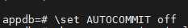
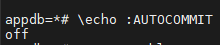
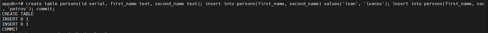
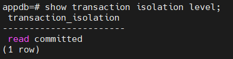
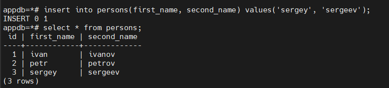
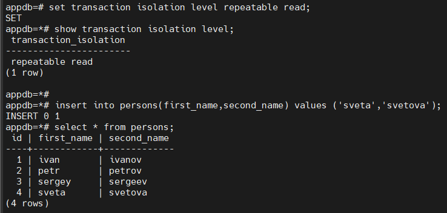
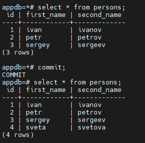

## Домашнее задание №1
### Название урока:   SQL и реляционные СУБД. Введение в PostgreSQL
Цель:
-   научиться работать с Google Cloud Platform на уровне Google Compute Engine (IaaS)
-   научиться управлять уровнем изоляции транзации в PostgreSQL и понимать особенность работы уровней read commited и repeatable read

Описание/Пошаговая инструкция выполнения домашнего задания:

-   создать новый проект в Яндекс облако или на любых ВМ, докере
-   далее создать инстанс виртуальной машины с дефолтными параметрами
-   добавить свой ssh ключ в metadata ВМ
-   зайти удаленным ssh (первая сессия), не забывайте про ssh-add
-   поставить PostgreSQL
-   зайти вторым ssh (вторая сессия)
-   запустить везде psql из под пользователя postgres
-   выключить auto commit
-   сделать

  
в первой сессии новую таблицу и наполнить ее данными create table persons(id serial, first_name text, second_name text); insert into persons(first_name, second_name) values('ivan', 'ivanov'); insert into persons(first_name, second_name) values('petr', 'petrov'); commit;

-   посмотреть текущий уровень изоляции: show transaction isolation level
-   начать новую транзакцию в обоих сессиях с дефолтным (не меняя) уровнем изоляции
-   в первой сессии добавить новую запись insert into persons(first_name, second_name) values('sergey', 'sergeev');
-   сделать select  _from persons во второй сессии_
-   видите ли вы новую запись и если да то почему?
-   завершить первую транзакцию - commit;
-   сделать  _select from persons во второй сессии_
-   видите ли вы новую запись и если да то почему?
-   завершите транзакцию во второй сессии
-   начать новые но уже repeatable read транзации - set transaction isolation level repeatable read;
-   в первой сессии добавить новую запись insert into persons(first_name, second_name) values('sveta', 'svetova');
-   сделать select* from persons во второй сессии*
-   видите ли вы новую запись и если да то почему?
-   завершить первую транзакцию - commit;
-   сделать select  _from persons во второй сессии_
-   видите ли вы новую запись и если да то почему?
-   завершить вторую транзакцию
-   сделать select * from persons во второй сессии
-   видите ли вы новую запись и если да то почему?


### Подготовительные мероприятия

1. Была создана виртуальная машина на Rocky Linux 9.6
2. Установлен docker
3. Создан docker-compose файл
4. Запущено было два контейнера с psql клиентом и postgresql сервером
5. Был отключен SELinux и firewalld
6. Открыл две psql сессии (в контейнере и с самого сервера)
7. Отключил в обоих сессиях autocommit командой ```\set AUTOCOMMIT off```. Стоит отменить что выключение autocommit действует только в рамках запущенной сессии. По умолчанию autocommit включен и нужен для фиксации изменений. Просмотреть включен или выключен ли autocommit можно командой ```\echo :AUTOCOMMIT```. 


Вот таким образом выключаем autocommit:


Вот таким образом проверяем что он выключен:


## Далее показана работа с базой данных

1. В первой сессии создана таблица


2. Далее смотрим текущий уровень изоляции командой ```show transaction isolation level```


3. Выполнено в первой сессии ```insert into persons(first_name, second_name) values('sergey', 'sergeev');```

Надо было выполнить команду и ответить на вопрос: ```сделать select * from persons во второй сессии```
и ```видите ли вы новую запись и если да то почему?```

Ответ: Во второй сессии изменения которые были сделаны в первой сессии не видны, пока что в первой сессии не будет выполнен commit. Текущий уровень изоляции не предусматривает грязное чтение, т.е. тех данных которые не были закоммичены.

4. Далее надо было изменить уровень изоляции командой в обоих сессиях ```set transaction isolation level repeatable read;``` 


Во второй сессии не было видно то что было выполнено в первой сессии, пока что во второй сессии не был выполнен commit (т.е. даже если в первой сессии мы сделаем commit то все равно не будет ничего нового видно во второй сессии).


Ответ: Это нормальное поведение при включенном уровне изоляции ```repeatable read```. При его включении выполняется как бы снимок данных в сессии на момент включения этого уровня изоляции и мы не видим новых данных, обычно это используется для составления отчетов, для того чтобы данные в момент работы не изменялись. После выполнения commit во второй сессии, уровень изоляции автоматически во всех двух сессиях переключается на ```read commited```, это уровень изоляции по умолчанию.