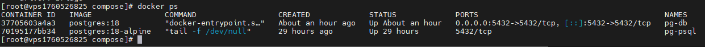

## Домашнее задание №2
### Название урока: Установка и настройка PostgteSQL в контейнере Docker

Цель:
- установить PostgreSQL в Docker контейнере
- настроить контейнер для внешнего подключения

### Описание/Пошаговая инструкция выполнения домашнего задания:
- создать ВМ с Ubuntu 20.04/22.04 или развернуть докер любым удобным способом
- поставить на нем Docker Engine
- сделать каталог /var/lib/postgres
- развернуть контейнер с PostgreSQL 15 смонтировав в него /var/lib/postgresql
- развернуть контейнер с клиентом postgres
- подключится из контейнера с клиентом к контейнеру с сервером и сделать таблицу с парой строк
- подключится к контейнеру с сервером с ноутбука/компьютера извне инстансов ЯО/места установки докера
- удалить контейнер с сервером
- создать его заново
- подключится снова из контейнера с клиентом к контейнеру с сервером
- проверить, что данные остались на месте
- оставляйте в ЛК ДЗ комментарии что и как вы делали и как боролись с проблемами

### Подготовительные мероприятия

1. Была создана виртуальная машина на Rocky Linux 9.6
2. Установлен docker
3. Создан docker-compose файл
4. Запущено было два контейнера с psql клиентом и postgresql сервером
5. Был отключен SELinux и firewalld

### Выполнение домашнего задания

Результатом выполнения данного задания стало:
1. Поднятие docker контейнеров через docker compose командой ```docker compose -f docker-compose.yaml up -d```



2. Пришло понимание, что для кастомной директории необходимо в docker-compose.yaml в переменных надо определять эту переменную ```PGDATA: /var/lib/docker-postgresql/data```. Без нее данные при перезапуске контейнера с БД будут пропадать. Т.Е. если даже в docker-compose.yaml будет определена директива volumes ```pgdata:/var/lib/docker-postgresql/data``` то этого мало.
Файл docker-compose.yaml приложен к домашнему заданию.

3. Так как файервол был выключен, мне удалось без проблем подключиться к PostgreSQL серверу извне по порту 5432.
