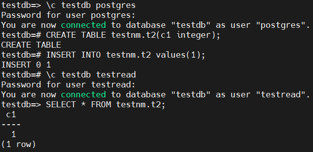

## Домашнее задание № 4
### Название урока: Работа с базами данных, пользователями и правами

Цель:
- создание новой базы данных, схемы и таблицы
- создание роли для чтения данных из созданной схемы созданной базы данных
- создание роли для чтения и записи из созданной схемы созданной базы данных

### Описание/Пошаговая инструкция выполнения домашнего задания:
- создайте новый кластер PostgresSQL 14
- зайдите в созданный кластер под пользователем postgres
- создайте новую базу данных ```testdb```
- зайдите в созданную базу данных под пользователем postgres
- создайте новую схему ```testnm```
- создайте новую таблицу ```t1``` с одной колонкой ```c1``` типа ```integer```
- вставьте строку со значением ```c1=1```
- создайте новую роль ```readonly```
- дайте новой роли право на подключение к базе данных ```testdb```
- дайте новой роли право на использование схемы ```testnm```
- дайте новой роли право на select для всех таблиц схемы ```testnm``
- создайте пользователя ```testread``` с паролем ```test123```
- дайте роль ```readonly``` пользователю ```testread```
- зайдите под пользователем ```testread``` в базу данных ```testdb```
- сделайте ```select * from t1```;
- получилось? (могло если вы делали сами не по шпаргалке и не упустили один существенный момент про который позже)
- напишите что именно произошло в тексте домашнего задания
- у вас есть идеи почему? ведь права то дали?
- посмотрите на список таблиц
- подсказка в шпаргалке под пунктом 20
- а почему так получилось с таблицей (если делали сами и без шпаргалки то может у вас все нормально)
- вернитесь в базу данных ```testdb``` под пользователем ```postgres```
- удалите таблицу ```t1```
- создайте ее заново но уже с явным указанием имени схемы ```testnm```
- вставьте строку со значением ```c1=1```
- зайдите под пользователем ```testread``` в базу данных ```testdb```
- сделайте ```select * from testnm.t1;```
- получилось?
- есть идеи почему? если нет - смотрите шпаргалку
- как сделать так чтобы такое больше не повторялось? если нет идей - смотрите шпаргалку
- сделайте ```select * from testnm.t1;```
- получилось?
- есть идеи почему? если нет - смотрите шпаргалку
- сделайте ```select * from testnm.t1;```
- получилось?
- ура!
- теперь попробуйте выполнить команду ```create table t2(c1 integer); insert into t2 values (2);```
- а как так? нам же никто прав на создание таблиц и ```insert``` в них под ролью ```readonly```?
- есть идеи как убрать эти права? если нет - смотрите шпаргалку
- если вы справились сами то расскажите что сделали и почему, если смотрели шпаргалку - объясните что сделали и почему выполнив указанные в ней команды
теперь попробуйте выполнить команду ```create table t3(c1 integer); insert into t2 values (2);```
- расскажите что получилось и почему

### Выполнение домашнего задания

- Локально подключился к инстансу PostgreSQL 18, создал БД и схему

- Создал новую таблицу в схеме ```testnm``` и вставил туда данные     

- Создал роль ```readonly```  

- Дал необходимые права для схемы ```testnm```. Создал пользователя с паролем, дал право входить в схему, дал права на уже созданную таблицу, дал права на чтение новых созданных таблиц, которые будет создавать пользователь ```postgres```, добавил пользователя ```testread``` в группу/роль ```readonly```.    


- Для того, чтобы ```testread``` мог подключиться к БД ```testdb``` надо поменять механизм аутентификации в файле ```pg_hba.conf``` и его перечитать     

```Перечитывание конфига```  

- Подключился под ```testread``` к базе ```testdb```    

- Чтобы проверить что права на чтение распространяются на последующие таблицы, создал новую таблицу и попробовать прочитать ее     

- Попробовал под пользователем ```testread``` создать таблицу командами ```create table t3(c1 integer); insert into t2 values (2);``` но не получилось так как нет прав на создание у ```readonly``` и у ```testread```. Командой ```GRANT CREATE ON SCHEMA testnm TO readonly;``` предоставляются такие права
 
- Исправляется вот так    
