## Домашнее задание № 5
### Название урока: Нагрузочное тестирование и тюнинг PostgreSQL

Цель:
- сделать нагрузочное тестирование PostgreSQL
- настроить параметры PostgreSQL для достижения максимальной производительности

### Описание/Пошаговая инструкция выполнения домашнего задания:
- развернуть виртуальную машину любым удобным способом
- поставить на неё PostgreSQL 15 любым способом
- настроить кластер PostgreSQL 15 на максимальную производительность не обращая внимание на возможные проблемы с надежностью в случае аварийной перезагрузки виртуальной машины
- нагрузить кластер через утилиту через утилиту pgbench (https://postgrespro.ru/docs/postgrespro/14/pgbench)
- написать какого значения tps удалось достичь, показать какие параметры в какие значения устанавливали и почему
Задание со *: аналогично протестировать через утилиту https://github.com/Percona-Lab/sysbench-tpcc (требует установки
https://github.com/akopytov/sysbench)

### Выполнение домашнего задания
- ВМ уже была развернула с прошлых домашних заданий (Rocky Linux 9.6)
- PostgreSQL 18 уже стоял на хосте (не Docker)
- Сначала был выполнен тест без настроек вообще, его результаты:
```Создание БД для pgbench```   
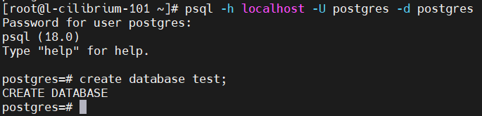

```Создание таблиц в БД```
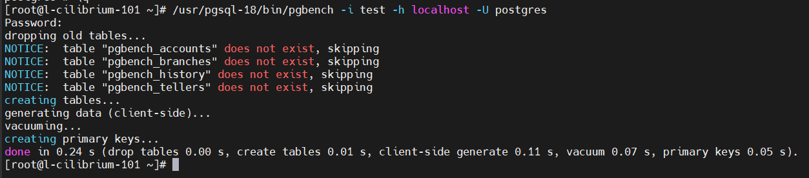

```Просмотр созданных таблиц```
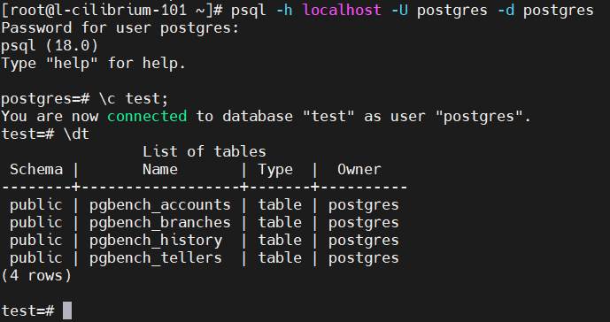

```Тестирование без каких-либо настроек```
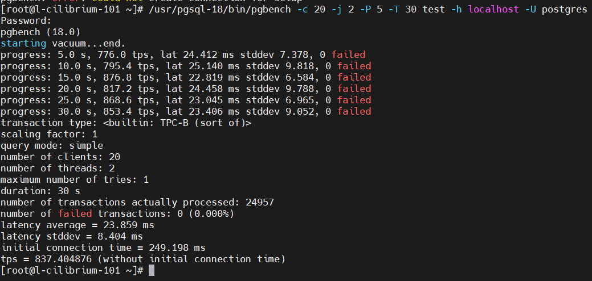

```Настройки под мою ВМ (первый тюнинг)```
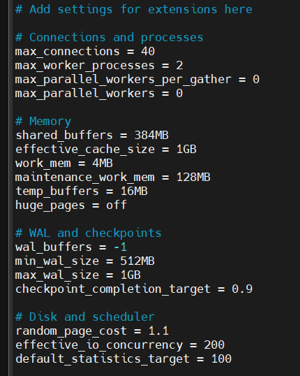

```Результаты после теста первого тюнинга```


```Чтобы ускорить результаты тестирования ввел дополнительные настройки, которые позволяют не ждать записи на диск, отключают fsync, отключают full page writes после чекпоинта```
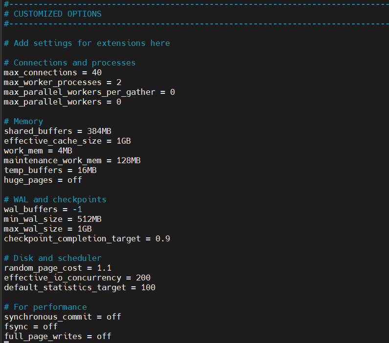

```Результаты второго тюнинга```
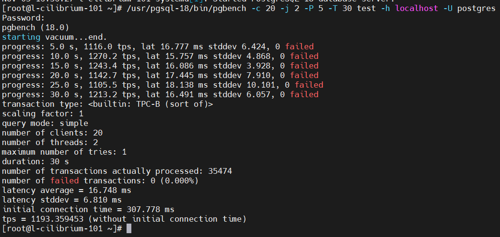

Как видно из результатов второго тюнинга, результаты изменились в сторону быстродействия.

- Теперь задание со зведкочкой
```Устанавливаем репозиторий для sysbench```
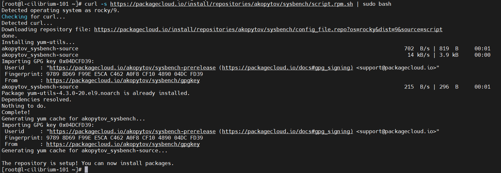

```Установка sysbench```
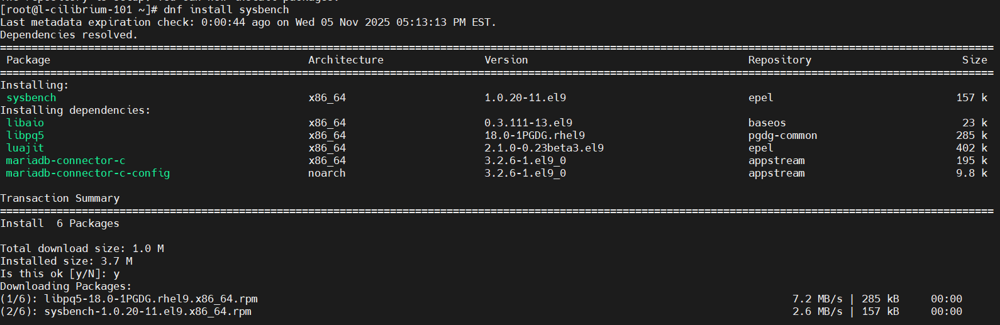

```Создаем БД под тест TPCC```
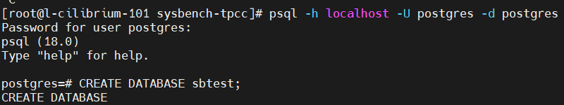

```TPCC подготовка```
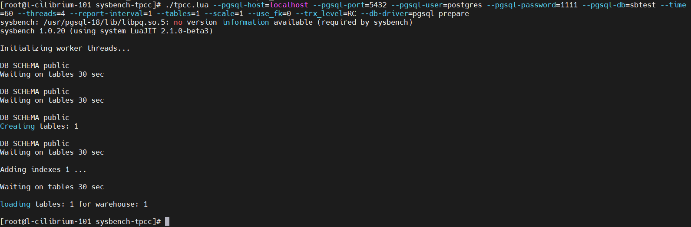

```TPCC запуск```
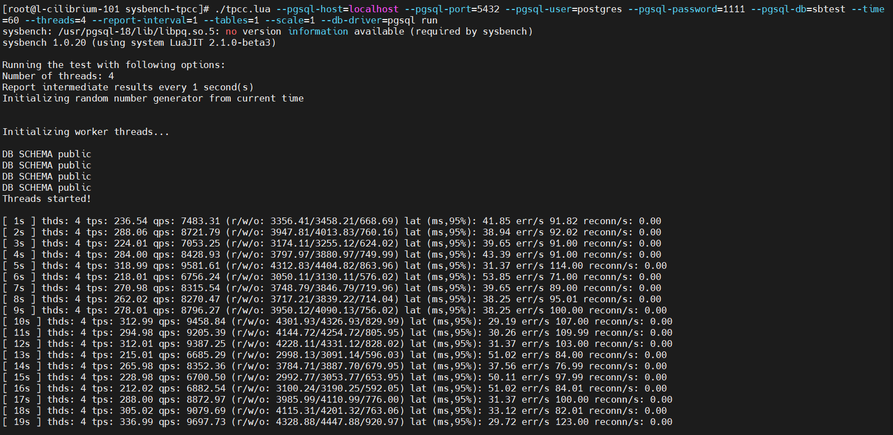

```TPCC результаты```
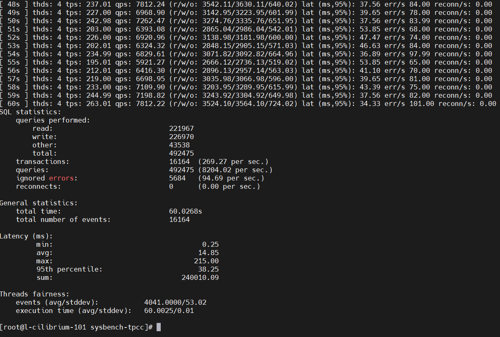

По результатам видно что для этой ВМ, результат хороший. 269 транзакций в секунду.

```Очистка тестовой таблицы```
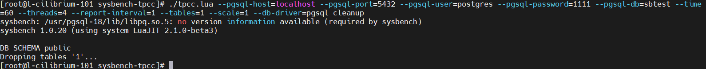