## Домашнее задание № 6
### Название урока: Настройка autovacuum с учетом особеностей производительности

Цель:
- запустить нагрузочный тест pgbench
- настроить параметры autovacuum
- проверить работу autovacuum

### Описание/Пошаговая инструкция выполнения домашнего задания:
- Создать инстанс ВМ с 2 ядрами и 4 Гб ОЗУ и SSD 10GB
- Установить на него PostgreSQL 15 с дефолтными настройками
- Создать БД для тестов: выполнить pgbench -i postgres
- Запустить pgbench -c8 -P 6 -T 60 -U postgres postgres
- Применить параметры настройки PostgreSQL из прикрепленного к материалам занятия файла
- Протестировать заново
- Что изменилось и почему?
- Создать таблицу с текстовым полем и заполнить случайными или сгенерированными данным в размере 1млн строк
- Посмотреть размер файла с таблицей
- 5 раз обновить все строчки и добавить к каждой строчке любой символ
- Посмотреть количество мертвых строчек в таблице и когда последний раз приходил автовакуум
- Подождать некоторое время, проверяя, пришел ли автовакуум
- 5 раз обновить все строчки и добавить к каждой строчке любой символ
- Посмотреть размер файла с таблицей
- Отключить Автовакуум на конкретной таблице
- 10 раз обновить все строчки и добавить к каждой строчке любой символ
- Посмотреть размер файла с таблицей
- Объясните полученный результат
- Не забудьте включить автовакуум
- Задание со *:
Написать анонимную процедуру, в которой в цикле 10 раз обновятся все строчки в искомой таблице.
Не забыть вывести номер шага цикла.

### Выполнение домашнего задания

- Запустил первый тест вот с такими настройками и получил вот такие результаты
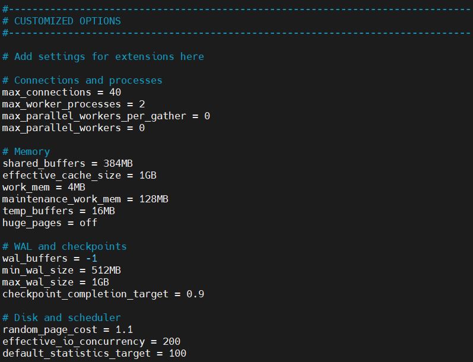

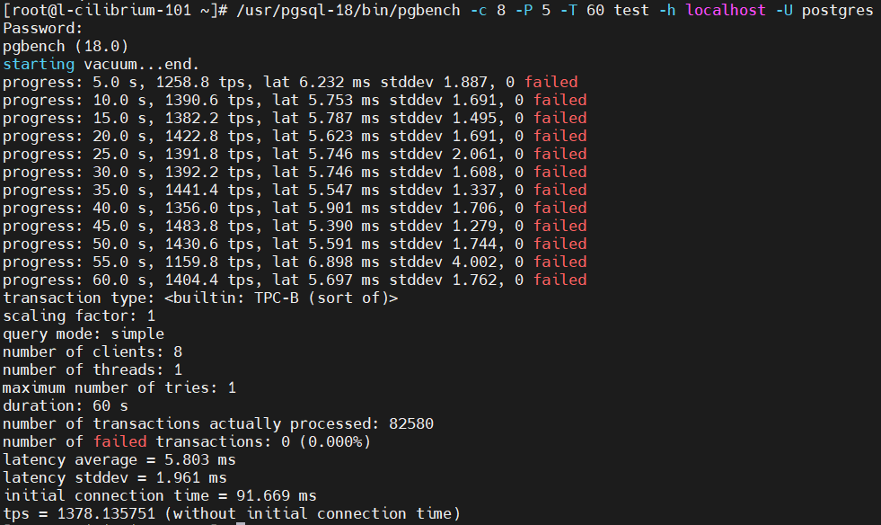

- Запустил второй тест вот с такими настройками и получил вот такие результаты


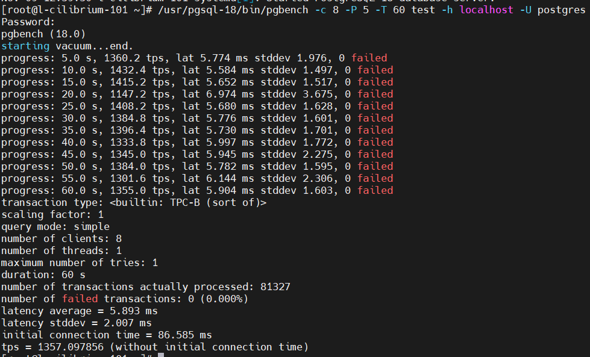

Т.Е. тут мы не видим никаких особенных различий.

- Далее я запустил тест на вот таких настройках и получил вот такой результат


```Результаты теста без кастомных настроек автовакуума```

```
/usr/pgsql-18/bin/pgbench -n -c 32 -j 8 -P 5 -T 900 test -h localhost -U postgres
Password:
pgbench (18.0)
progress: 5.0 s, 780.8 tps, lat 37.039 ms stddev 14.908, 0 failed
progress: 10.0 s, 1012.0 tps, lat 31.625 ms stddev 22.704, 0 failed
progress: 15.0 s, 1029.8 tps, lat 31.087 ms stddev 8.276, 0 failed
progress: 20.0 s, 1057.0 tps, lat 30.282 ms stddev 7.291, 0 failed
progress: 25.0 s, 1010.0 tps, lat 31.692 ms stddev 8.650, 0 failed
progress: 30.0 s, 1138.0 tps, lat 28.099 ms stddev 7.481, 0 failed
progress: 35.0 s, 1141.4 tps, lat 28.041 ms stddev 6.905, 0 failed
progress: 40.0 s, 1118.4 tps, lat 28.609 ms stddev 9.417, 0 failed
progress: 45.0 s, 979.0 tps, lat 32.712 ms stddev 17.653, 0 failed
progress: 50.0 s, 1142.6 tps, lat 27.979 ms stddev 7.369, 0 failed
progress: 55.0 s, 1111.8 tps, lat 28.800 ms stddev 9.588, 0 failed
progress: 60.0 s, 1191.4 tps, lat 26.862 ms stddev 8.407, 0 failed
progress: 65.0 s, 1170.2 tps, lat 27.325 ms stddev 8.054, 0 failed
progress: 70.0 s, 1091.2 tps, lat 29.337 ms stddev 10.933, 0 failed
progress: 75.0 s, 1199.8 tps, lat 26.694 ms stddev 6.804, 0 failed
progress: 80.0 s, 1195.2 tps, lat 26.780 ms stddev 9.237, 0 failed
progress: 85.0 s, 1195.2 tps, lat 26.756 ms stddev 7.099, 0 failed
progress: 90.0 s, 1247.0 tps, lat 25.657 ms stddev 6.608, 0 failed
progress: 95.0 s, 1241.6 tps, lat 25.763 ms stddev 7.000, 0 failed
progress: 100.0 s, 1257.8 tps, lat 25.462 ms stddev 5.643, 0 failed
progress: 105.0 s, 895.4 tps, lat 35.715 ms stddev 17.144, 0 failed
progress: 110.0 s, 1265.4 tps, lat 25.301 ms stddev 6.059, 0 failed
progress: 115.0 s, 1143.8 tps, lat 27.963 ms stddev 9.433, 0 failed
progress: 120.0 s, 1238.2 tps, lat 25.835 ms stddev 5.847, 0 failed
progress: 125.0 s, 1074.6 tps, lat 29.770 ms stddev 11.042, 0 failed
progress: 130.0 s, 1148.8 tps, lat 27.861 ms stddev 6.914, 0 failed
progress: 135.0 s, 1213.2 tps, lat 26.374 ms stddev 10.116, 0 failed
progress: 140.0 s, 972.0 tps, lat 32.899 ms stddev 8.102, 0 failed
progress: 145.0 s, 1231.6 tps, lat 26.030 ms stddev 7.586, 0 failed
progress: 150.0 s, 1261.4 tps, lat 25.350 ms stddev 9.090, 0 failed
progress: 155.0 s, 1259.2 tps, lat 25.424 ms stddev 7.633, 0 failed
progress: 160.0 s, 1312.8 tps, lat 24.362 ms stddev 5.989, 0 failed
progress: 165.0 s, 1182.8 tps, lat 26.957 ms stddev 11.540, 0 failed
progress: 170.0 s, 1174.6 tps, lat 27.358 ms stddev 11.614, 0 failed
progress: 175.0 s, 1220.6 tps, lat 26.203 ms stddev 7.688, 0 failed
progress: 180.0 s, 1208.6 tps, lat 26.486 ms stddev 8.351, 0 failed
progress: 185.0 s, 1181.4 tps, lat 27.083 ms stddev 7.300, 0 failed
progress: 190.0 s, 1282.8 tps, lat 24.952 ms stddev 5.790, 0 failed
progress: 195.0 s, 1300.0 tps, lat 24.598 ms stddev 6.589, 0 failed
progress: 200.0 s, 1037.8 tps, lat 30.822 ms stddev 7.810, 0 failed
progress: 205.0 s, 1308.8 tps, lat 24.481 ms stddev 6.881, 0 failed
progress: 210.0 s, 1272.4 tps, lat 25.134 ms stddev 9.338, 0 failed
progress: 215.0 s, 1271.6 tps, lat 25.149 ms stddev 6.604, 0 failed
progress: 220.0 s, 1226.4 tps, lat 26.108 ms stddev 6.379, 0 failed
progress: 225.0 s, 1252.4 tps, lat 25.470 ms stddev 7.249, 0 failed
progress: 230.0 s, 1092.0 tps, lat 29.377 ms stddev 18.231, 0 failed
progress: 235.0 s, 1137.4 tps, lat 28.138 ms stddev 8.548, 0 failed
progress: 240.0 s, 1144.8 tps, lat 27.931 ms stddev 10.152, 0 failed
progress: 245.0 s, 1204.0 tps, lat 26.623 ms stddev 7.322, 0 failed
progress: 250.0 s, 1291.0 tps, lat 24.780 ms stddev 5.573, 0 failed
progress: 255.0 s, 1267.0 tps, lat 25.253 ms stddev 6.540, 0 failed
progress: 260.0 s, 1273.4 tps, lat 25.131 ms stddev 5.602, 0 failed
progress: 265.0 s, 1234.6 tps, lat 25.924 ms stddev 8.360, 0 failed
progress: 270.0 s, 1287.8 tps, lat 24.841 ms stddev 6.379, 0 failed
progress: 275.0 s, 1265.0 tps, lat 25.284 ms stddev 7.382, 0 failed
progress: 280.0 s, 1254.4 tps, lat 25.485 ms stddev 5.498, 0 failed
progress: 285.0 s, 1234.0 tps, lat 25.992 ms stddev 7.527, 0 failed
progress: 290.0 s, 1085.4 tps, lat 29.426 ms stddev 14.915, 0 failed
progress: 295.0 s, 1264.6 tps, lat 25.328 ms stddev 7.472, 0 failed
progress: 300.0 s, 1288.0 tps, lat 24.838 ms stddev 6.181, 0 failed
progress: 305.0 s, 1093.6 tps, lat 29.267 ms stddev 10.645, 0 failed
progress: 310.0 s, 1218.8 tps, lat 26.217 ms stddev 5.875, 0 failed
progress: 315.0 s, 1247.0 tps, lat 25.700 ms stddev 6.814, 0 failed
progress: 320.0 s, 1181.6 tps, lat 27.092 ms stddev 7.996, 0 failed
progress: 325.0 s, 1161.2 tps, lat 27.522 ms stddev 9.756, 0 failed
progress: 330.0 s, 1155.4 tps, lat 27.691 ms stddev 7.681, 0 failed
progress: 335.0 s, 1020.2 tps, lat 31.185 ms stddev 9.909, 0 failed
progress: 340.0 s, 1201.0 tps, lat 26.814 ms stddev 9.749, 0 failed
progress: 345.0 s, 1228.4 tps, lat 26.051 ms stddev 7.974, 0 failed
progress: 350.0 s, 865.8 tps, lat 36.711 ms stddev 21.335, 0 failed
progress: 355.0 s, 1090.0 tps, lat 29.540 ms stddev 11.180, 0 failed
progress: 360.0 s, 1141.8 tps, lat 28.047 ms stddev 8.286, 0 failed
progress: 365.0 s, 1277.0 tps, lat 25.059 ms stddev 6.122, 0 failed
progress: 370.0 s, 1262.8 tps, lat 25.349 ms stddev 7.886, 0 failed
progress: 375.0 s, 1302.2 tps, lat 24.567 ms stddev 9.120, 0 failed
progress: 380.0 s, 1331.8 tps, lat 24.020 ms stddev 5.181, 0 failed
progress: 385.0 s, 1330.5 tps, lat 24.040 ms stddev 6.537, 0 failed
progress: 390.0 s, 1377.5 tps, lat 23.246 ms stddev 5.610, 0 failed
progress: 395.0 s, 1280.0 tps, lat 24.997 ms stddev 6.778, 0 failed
progress: 400.0 s, 1233.8 tps, lat 25.936 ms stddev 8.851, 0 failed
progress: 405.0 s, 1306.2 tps, lat 24.503 ms stddev 6.510, 0 failed
progress: 410.0 s, 1218.8 tps, lat 26.221 ms stddev 8.685, 0 failed
progress: 415.0 s, 1092.6 tps, lat 29.305 ms stddev 15.618, 0 failed
progress: 420.0 s, 1214.8 tps, lat 26.334 ms stddev 7.171, 0 failed
progress: 425.0 s, 1325.8 tps, lat 24.156 ms stddev 6.676, 0 failed
progress: 430.0 s, 1240.8 tps, lat 25.780 ms stddev 6.922, 0 failed
progress: 435.0 s, 1176.6 tps, lat 27.202 ms stddev 9.577, 0 failed
progress: 440.0 s, 1014.4 tps, lat 31.544 ms stddev 7.377, 0 failed
progress: 445.0 s, 1232.0 tps, lat 25.975 ms stddev 7.544, 0 failed
progress: 450.0 s, 1316.6 tps, lat 24.310 ms stddev 5.979, 0 failed
progress: 455.0 s, 1307.6 tps, lat 24.472 ms stddev 6.153, 0 failed
progress: 460.0 s, 1272.4 tps, lat 25.117 ms stddev 7.128, 0 failed
progress: 465.0 s, 1236.4 tps, lat 25.907 ms stddev 8.607, 0 failed
progress: 470.0 s, 1344.0 tps, lat 23.818 ms stddev 5.532, 0 failed
progress: 475.0 s, 1004.4 tps, lat 31.828 ms stddev 16.832, 0 failed
progress: 480.0 s, 1246.4 tps, lat 25.672 ms stddev 7.041, 0 failed
progress: 485.0 s, 1151.4 tps, lat 27.800 ms stddev 9.375, 0 failed
progress: 490.0 s, 1075.4 tps, lat 29.762 ms stddev 12.431, 0 failed
progress: 495.0 s, 1113.2 tps, lat 28.739 ms stddev 8.137, 0 failed
progress: 500.0 s, 922.8 tps, lat 34.682 ms stddev 8.239, 0 failed
progress: 505.0 s, 1109.2 tps, lat 28.805 ms stddev 7.756, 0 failed
progress: 510.0 s, 1247.8 tps, lat 25.707 ms stddev 9.011, 0 failed
progress: 515.0 s, 1181.4 tps, lat 27.051 ms stddev 7.973, 0 failed
progress: 520.0 s, 1128.6 tps, lat 28.373 ms stddev 8.341, 0 failed
progress: 525.0 s, 1335.0 tps, lat 23.975 ms stddev 6.015, 0 failed
progress: 530.0 s, 1318.0 tps, lat 24.278 ms stddev 5.845, 0 failed
progress: 535.0 s, 1056.6 tps, lat 30.139 ms stddev 16.385, 0 failed
progress: 540.0 s, 1175.6 tps, lat 27.355 ms stddev 9.363, 0 failed
progress: 545.0 s, 1120.8 tps, lat 28.517 ms stddev 7.798, 0 failed
progress: 550.0 s, 1181.4 tps, lat 27.105 ms stddev 6.803, 0 failed
progress: 555.0 s, 1237.8 tps, lat 25.850 ms stddev 6.430, 0 failed
progress: 560.0 s, 1199.2 tps, lat 26.673 ms stddev 7.393, 0 failed
progress: 565.0 s, 1170.0 tps, lat 27.359 ms stddev 8.278, 0 failed
progress: 570.0 s, 1228.8 tps, lat 26.041 ms stddev 6.408, 0 failed
progress: 575.0 s, 1184.6 tps, lat 27.006 ms stddev 9.870, 0 failed
progress: 580.0 s, 1260.2 tps, lat 25.404 ms stddev 6.246, 0 failed
progress: 585.0 s, 1264.2 tps, lat 25.295 ms stddev 6.847, 0 failed
progress: 590.0 s, 1279.8 tps, lat 25.028 ms stddev 6.272, 0 failed
progress: 595.0 s, 959.4 tps, lat 33.137 ms stddev 20.068, 0 failed
progress: 600.0 s, 1159.0 tps, lat 27.789 ms stddev 13.728, 0 failed
progress: 605.0 s, 1214.4 tps, lat 26.351 ms stddev 8.874, 0 failed
progress: 610.0 s, 1335.2 tps, lat 23.963 ms stddev 4.991, 0 failed
progress: 615.0 s, 1269.6 tps, lat 25.200 ms stddev 7.302, 0 failed
progress: 620.0 s, 1202.6 tps, lat 26.613 ms stddev 6.915, 0 failed
progress: 625.0 s, 1184.2 tps, lat 27.024 ms stddev 7.770, 0 failed
progress: 630.0 s, 1242.6 tps, lat 25.737 ms stddev 6.327, 0 failed
progress: 635.0 s, 1213.6 tps, lat 26.230 ms stddev 8.335, 0 failed
progress: 640.0 s, 1311.6 tps, lat 24.548 ms stddev 6.525, 0 failed
progress: 645.0 s, 1235.2 tps, lat 25.890 ms stddev 9.069, 0 failed
progress: 650.0 s, 976.0 tps, lat 32.785 ms stddev 7.889, 0 failed
progress: 655.0 s, 1163.4 tps, lat 27.498 ms stddev 7.710, 0 failed
progress: 660.0 s, 1078.2 tps, lat 29.710 ms stddev 15.092, 0 failed
progress: 665.0 s, 1296.8 tps, lat 24.663 ms stddev 6.449, 0 failed
progress: 670.0 s, 1227.6 tps, lat 26.058 ms stddev 10.810, 0 failed
progress: 675.0 s, 1294.6 tps, lat 24.711 ms stddev 6.940, 0 failed
progress: 680.0 s, 1283.6 tps, lat 24.951 ms stddev 5.630, 0 failed
progress: 685.0 s, 1346.6 tps, lat 23.760 ms stddev 6.598, 0 failed
progress: 690.0 s, 1325.6 tps, lat 24.139 ms stddev 5.417, 0 failed
progress: 695.0 s, 1276.8 tps, lat 25.054 ms stddev 7.096, 0 failed
progress: 700.0 s, 1283.6 tps, lat 24.943 ms stddev 8.188, 0 failed
progress: 705.0 s, 1318.6 tps, lat 24.259 ms stddev 5.845, 0 failed
progress: 710.0 s, 1290.2 tps, lat 24.799 ms stddev 6.355, 0 failed
progress: 715.0 s, 1205.2 tps, lat 26.526 ms stddev 7.323, 0 failed
progress: 720.0 s, 1027.2 tps, lat 31.202 ms stddev 15.685, 0 failed
progress: 725.0 s, 1286.4 tps, lat 24.860 ms stddev 6.300, 0 failed
progress: 730.0 s, 1298.0 tps, lat 24.651 ms stddev 6.630, 0 failed
progress: 735.0 s, 1203.4 tps, lat 26.605 ms stddev 11.828, 0 failed
progress: 740.0 s, 1222.6 tps, lat 26.139 ms stddev 7.201, 0 failed
progress: 745.0 s, 1325.2 tps, lat 24.178 ms stddev 6.307, 0 failed
progress: 750.0 s, 1294.6 tps, lat 24.707 ms stddev 6.173, 0 failed
progress: 755.0 s, 1312.8 tps, lat 24.380 ms stddev 6.527, 0 failed
progress: 760.0 s, 1332.0 tps, lat 24.005 ms stddev 5.534, 0 failed
progress: 765.0 s, 1284.4 tps, lat 24.919 ms stddev 9.140, 0 failed
progress: 770.0 s, 1289.8 tps, lat 24.797 ms stddev 5.359, 0 failed
progress: 775.0 s, 1169.2 tps, lat 27.387 ms stddev 8.408, 0 failed
progress: 780.0 s, 1062.2 tps, lat 30.127 ms stddev 14.836, 0 failed
progress: 785.0 s, 1224.2 tps, lat 26.150 ms stddev 7.304, 0 failed
progress: 790.0 s, 1332.6 tps, lat 24.001 ms stddev 5.156, 0 failed
progress: 795.0 s, 1198.8 tps, lat 26.712 ms stddev 10.769, 0 failed
progress: 800.0 s, 1311.0 tps, lat 24.393 ms stddev 5.551, 0 failed
progress: 805.0 s, 1262.0 tps, lat 25.376 ms stddev 6.356, 0 failed
progress: 810.0 s, 1344.2 tps, lat 23.787 ms stddev 5.161, 0 failed
progress: 815.0 s, 1230.2 tps, lat 25.997 ms stddev 7.225, 0 failed
progress: 820.0 s, 1241.6 tps, lat 25.809 ms stddev 6.848, 0 failed
progress: 825.0 s, 1203.8 tps, lat 26.562 ms stddev 7.861, 0 failed
progress: 830.0 s, 1136.2 tps, lat 28.161 ms stddev 10.777, 0 failed
progress: 835.0 s, 1157.6 tps, lat 27.598 ms stddev 7.546, 0 failed
progress: 840.0 s, 1035.6 tps, lat 30.941 ms stddev 14.426, 0 failed
progress: 845.0 s, 1194.6 tps, lat 26.802 ms stddev 7.309, 0 failed
progress: 850.0 s, 1188.2 tps, lat 26.918 ms stddev 6.616, 0 failed
progress: 855.0 s, 1239.6 tps, lat 25.811 ms stddev 6.889, 0 failed
progress: 860.0 s, 1245.6 tps, lat 25.698 ms stddev 7.542, 0 failed
progress: 865.0 s, 1243.6 tps, lat 25.735 ms stddev 7.177, 0 failed
progress: 870.0 s, 1336.6 tps, lat 23.926 ms stddev 5.040, 0 failed
progress: 875.0 s, 1278.4 tps, lat 25.057 ms stddev 6.371, 0 failed
progress: 880.0 s, 1247.2 tps, lat 25.655 ms stddev 5.779, 0 failed
progress: 885.0 s, 1212.8 tps, lat 26.393 ms stddev 6.672, 0 failed
progress: 890.0 s, 1212.6 tps, lat 26.378 ms stddev 6.325, 0 failed
progress: 895.0 s, 1141.0 tps, lat 28.010 ms stddev 9.845, 0 failed
progress: 900.0 s, 847.8 tps, lat 37.414 ms stddev 18.734, 0 failed
transaction type: <builtin: TPC-B (sort of)>
scaling factor: 50
query mode: simple
number of clients: 32
number of threads: 8
maximum number of tries: 1
duration: 900 s
number of transactions actually processed: 1079682
number of failed transactions: 0 (0.000%)
latency average = 26.663 ms
latency stddev = 9.115 ms
initial connection time = 463.251 ms
tps = 1200.022742 (without initial connection time)
```
Т.Е. здесь мы видим что при работе автовакуума идет небольшая просадка TPS.

- Далее я изменил конфигурацию настроек из того, что было предложено в материалах


```И получил вот такой результат```

```
/usr/pgsql-18/bin/pgbench -n -c 32 -j 8 -P 5 -T 900 test -h localhost -U postgres
Password:
pgbench (18.0)
progress: 5.0 s, 1047.6 tps, lat 28.467 ms stddev 8.431, 0 failed
progress: 10.0 s, 1161.0 tps, lat 27.312 ms stddev 7.716, 0 failed
progress: 15.0 s, 1169.0 tps, lat 27.565 ms stddev 28.667, 0 failed
progress: 20.0 s, 995.6 tps, lat 32.200 ms stddev 16.589, 0 failed
progress: 25.0 s, 1005.4 tps, lat 31.691 ms stddev 14.554, 0 failed
progress: 30.0 s, 1133.6 tps, lat 28.311 ms stddev 10.054, 0 failed
progress: 35.0 s, 1087.6 tps, lat 29.461 ms stddev 10.760, 0 failed
progress: 40.0 s, 1042.2 tps, lat 30.721 ms stddev 11.742, 0 failed
progress: 45.0 s, 1064.0 tps, lat 30.032 ms stddev 8.226, 0 failed
progress: 50.0 s, 1059.2 tps, lat 30.240 ms stddev 9.519, 0 failed
progress: 55.0 s, 954.8 tps, lat 33.530 ms stddev 14.579, 0 failed
progress: 60.0 s, 1254.8 tps, lat 25.485 ms stddev 5.383, 0 failed
progress: 65.0 s, 1160.4 tps, lat 27.573 ms stddev 8.525, 0 failed
progress: 70.0 s, 1148.4 tps, lat 27.869 ms stddev 8.733, 0 failed
progress: 75.0 s, 1163.6 tps, lat 27.494 ms stddev 8.632, 0 failed
progress: 80.0 s, 1007.0 tps, lat 31.804 ms stddev 16.406, 0 failed
progress: 85.0 s, 1163.8 tps, lat 27.481 ms stddev 8.313, 0 failed
progress: 90.0 s, 1191.4 tps, lat 26.851 ms stddev 11.413, 0 failed
progress: 95.0 s, 1270.0 tps, lat 25.214 ms stddev 6.272, 0 failed
progress: 100.0 s, 1191.2 tps, lat 26.851 ms stddev 7.448, 0 failed
progress: 105.0 s, 1268.8 tps, lat 25.205 ms stddev 6.305, 0 failed
progress: 110.0 s, 1278.8 tps, lat 25.036 ms stddev 5.467, 0 failed
progress: 115.0 s, 1258.4 tps, lat 25.422 ms stddev 8.940, 0 failed
progress: 120.0 s, 1234.2 tps, lat 25.875 ms stddev 8.000, 0 failed
progress: 125.0 s, 1233.4 tps, lat 26.016 ms stddev 7.990, 0 failed
progress: 130.0 s, 1211.2 tps, lat 26.404 ms stddev 7.561, 0 failed
progress: 135.0 s, 1180.8 tps, lat 27.100 ms stddev 10.182, 0 failed
progress: 140.0 s, 1063.4 tps, lat 30.083 ms stddev 14.044, 0 failed
progress: 145.0 s, 1286.0 tps, lat 24.882 ms stddev 6.049, 0 failed
progress: 150.0 s, 1133.6 tps, lat 28.170 ms stddev 8.319, 0 failed
progress: 155.0 s, 1124.0 tps, lat 28.507 ms stddev 13.493, 0 failed
progress: 160.0 s, 1264.0 tps, lat 25.336 ms stddev 6.162, 0 failed
progress: 165.0 s, 1258.2 tps, lat 25.435 ms stddev 6.931, 0 failed
progress: 170.0 s, 1255.2 tps, lat 25.507 ms stddev 7.119, 0 failed
progress: 175.0 s, 1289.6 tps, lat 24.821 ms stddev 6.790, 0 failed
progress: 180.0 s, 1290.0 tps, lat 24.798 ms stddev 5.883, 0 failed
progress: 185.0 s, 1180.4 tps, lat 27.118 ms stddev 9.144, 0 failed
progress: 190.0 s, 1252.0 tps, lat 25.566 ms stddev 6.181, 0 failed
progress: 195.0 s, 1232.4 tps, lat 25.934 ms stddev 6.869, 0 failed
progress: 200.0 s, 1072.2 tps, lat 29.750 ms stddev 11.050, 0 failed
progress: 205.0 s, 1138.4 tps, lat 28.192 ms stddev 11.796, 0 failed
progress: 210.0 s, 1160.4 tps, lat 27.606 ms stddev 7.303, 0 failed
progress: 215.0 s, 1080.6 tps, lat 29.609 ms stddev 9.272, 0 failed
progress: 220.0 s, 1096.4 tps, lat 29.147 ms stddev 10.076, 0 failed
progress: 225.0 s, 1214.8 tps, lat 26.382 ms stddev 7.123, 0 failed
progress: 230.0 s, 1252.8 tps, lat 25.512 ms stddev 6.985, 0 failed
progress: 235.0 s, 1121.4 tps, lat 28.551 ms stddev 7.942, 0 failed
progress: 240.0 s, 1200.6 tps, lat 26.645 ms stddev 7.145, 0 failed
progress: 245.0 s, 1184.8 tps, lat 26.989 ms stddev 8.720, 0 failed
progress: 250.0 s, 1146.0 tps, lat 27.952 ms stddev 10.613, 0 failed
progress: 255.0 s, 1181.0 tps, lat 27.107 ms stddev 8.344, 0 failed
progress: 260.0 s, 1275.2 tps, lat 25.097 ms stddev 6.443, 0 failed
progress: 265.0 s, 973.4 tps, lat 32.734 ms stddev 16.426, 0 failed
progress: 270.0 s, 1163.4 tps, lat 27.592 ms stddev 7.483, 0 failed
progress: 275.0 s, 1188.4 tps, lat 26.947 ms stddev 10.580, 0 failed
progress: 280.0 s, 1257.8 tps, lat 25.455 ms stddev 6.405, 0 failed
progress: 285.0 s, 1153.0 tps, lat 27.733 ms stddev 9.950, 0 failed
progress: 290.0 s, 1221.4 tps, lat 26.202 ms stddev 8.369, 0 failed
progress: 295.0 s, 1219.4 tps, lat 26.245 ms stddev 7.261, 0 failed
progress: 300.0 s, 1219.6 tps, lat 26.212 ms stddev 6.568, 0 failed
progress: 305.0 s, 1167.8 tps, lat 27.431 ms stddev 8.662, 0 failed
progress: 310.0 s, 1233.6 tps, lat 25.935 ms stddev 8.315, 0 failed
progress: 315.0 s, 1205.2 tps, lat 26.532 ms stddev 9.376, 0 failed
progress: 320.0 s, 1235.6 tps, lat 25.905 ms stddev 6.140, 0 failed
progress: 325.0 s, 1043.8 tps, lat 30.651 ms stddev 17.619, 0 failed
progress: 330.0 s, 1244.6 tps, lat 25.715 ms stddev 6.636, 0 failed
progress: 335.0 s, 1259.2 tps, lat 25.399 ms stddev 6.755, 0 failed
progress: 340.0 s, 1263.4 tps, lat 25.336 ms stddev 6.038, 0 failed
progress: 345.0 s, 1236.2 tps, lat 25.918 ms stddev 13.620, 0 failed
progress: 350.0 s, 1282.8 tps, lat 24.928 ms stddev 6.330, 0 failed
progress: 355.0 s, 1346.4 tps, lat 23.735 ms stddev 6.320, 0 failed
progress: 360.0 s, 1308.6 tps, lat 24.479 ms stddev 6.816, 0 failed
progress: 365.0 s, 1264.4 tps, lat 25.307 ms stddev 7.918, 0 failed
progress: 370.0 s, 1227.4 tps, lat 26.072 ms stddev 7.193, 0 failed
progress: 375.0 s, 1289.2 tps, lat 24.817 ms stddev 7.280, 0 failed
progress: 380.0 s, 1222.6 tps, lat 26.178 ms stddev 9.549, 0 failed
progress: 385.0 s, 1075.4 tps, lat 29.775 ms stddev 14.252, 0 failed
progress: 390.0 s, 1282.0 tps, lat 24.953 ms stddev 5.495, 0 failed
progress: 395.0 s, 1213.4 tps, lat 26.382 ms stddev 9.965, 0 failed
progress: 400.0 s, 1103.8 tps, lat 28.901 ms stddev 8.076, 0 failed
progress: 405.0 s, 1060.6 tps, lat 30.210 ms stddev 8.657, 0 failed
progress: 410.0 s, 1103.0 tps, lat 29.023 ms stddev 10.658, 0 failed
progress: 415.0 s, 1203.6 tps, lat 26.562 ms stddev 8.255, 0 failed
progress: 420.0 s, 1200.8 tps, lat 26.690 ms stddev 7.119, 0 failed
progress: 425.0 s, 1235.0 tps, lat 25.919 ms stddev 7.790, 0 failed
progress: 430.0 s, 1237.6 tps, lat 25.854 ms stddev 6.527, 0 failed
progress: 435.0 s, 1073.6 tps, lat 29.816 ms stddev 10.125, 0 failed
progress: 440.0 s, 1193.4 tps, lat 26.816 ms stddev 6.606, 0 failed
progress: 445.0 s, 1077.8 tps, lat 29.616 ms stddev 13.168, 0 failed
progress: 450.0 s, 1178.2 tps, lat 27.175 ms stddev 11.138, 0 failed
progress: 455.0 s, 1146.0 tps, lat 27.965 ms stddev 7.938, 0 failed
progress: 460.0 s, 1229.6 tps, lat 26.034 ms stddev 6.987, 0 failed
progress: 465.0 s, 1238.8 tps, lat 25.804 ms stddev 7.076, 0 failed
progress: 470.0 s, 1010.8 tps, lat 31.643 ms stddev 10.370, 0 failed
progress: 475.0 s, 1240.8 tps, lat 25.814 ms stddev 8.125, 0 failed
progress: 480.0 s, 1206.6 tps, lat 26.474 ms stddev 7.564, 0 failed
progress: 485.0 s, 973.6 tps, lat 32.865 ms stddev 12.224, 0 failed
progress: 490.0 s, 990.8 tps, lat 32.373 ms stddev 14.258, 0 failed
progress: 495.0 s, 1032.6 tps, lat 30.920 ms stddev 9.359, 0 failed
progress: 500.0 s, 1036.6 tps, lat 30.870 ms stddev 7.554, 0 failed
progress: 505.0 s, 939.4 tps, lat 34.080 ms stddev 11.016, 0 failed
progress: 510.0 s, 752.2 tps, lat 42.550 ms stddev 32.791, 0 failed
progress: 515.0 s, 1202.8 tps, lat 26.620 ms stddev 6.959, 0 failed
progress: 520.0 s, 1161.4 tps, lat 27.552 ms stddev 7.628, 0 failed
progress: 525.0 s, 1177.6 tps, lat 27.186 ms stddev 7.043, 0 failed
progress: 530.0 s, 1181.4 tps, lat 27.089 ms stddev 5.785, 0 failed
progress: 535.0 s, 1212.2 tps, lat 26.377 ms stddev 6.966, 0 failed
progress: 540.0 s, 1185.0 tps, lat 27.014 ms stddev 7.367, 0 failed
progress: 545.0 s, 1107.2 tps, lat 28.903 ms stddev 8.775, 0 failed
progress: 550.0 s, 972.0 tps, lat 32.883 ms stddev 9.298, 0 failed
progress: 555.0 s, 943.6 tps, lat 33.958 ms stddev 11.545, 0 failed
progress: 560.0 s, 1045.8 tps, lat 30.558 ms stddev 7.942, 0 failed
progress: 565.0 s, 1081.2 tps, lat 29.623 ms stddev 9.125, 0 failed
progress: 570.0 s, 840.8 tps, lat 37.949 ms stddev 18.182, 0 failed
progress: 575.0 s, 1103.4 tps, lat 29.089 ms stddev 9.484, 0 failed
progress: 580.0 s, 1005.8 tps, lat 31.807 ms stddev 9.760, 0 failed
progress: 585.0 s, 1086.8 tps, lat 29.436 ms stddev 7.836, 0 failed
progress: 590.0 s, 1120.6 tps, lat 28.570 ms stddev 7.114, 0 failed
progress: 595.0 s, 1142.6 tps, lat 28.000 ms stddev 8.060, 0 failed
progress: 600.0 s, 993.4 tps, lat 32.212 ms stddev 9.104, 0 failed
progress: 605.0 s, 996.8 tps, lat 31.931 ms stddev 12.246, 0 failed
progress: 610.0 s, 918.6 tps, lat 35.003 ms stddev 11.519, 0 failed
progress: 615.0 s, 1002.0 tps, lat 31.947 ms stddev 8.880, 0 failed
progress: 620.0 s, 1084.6 tps, lat 29.486 ms stddev 7.316, 0 failed
progress: 625.0 s, 1053.2 tps, lat 30.418 ms stddev 9.216, 0 failed
progress: 630.0 s, 883.8 tps, lat 36.219 ms stddev 19.286, 0 failed
progress: 635.0 s, 1100.6 tps, lat 29.036 ms stddev 9.285, 0 failed
progress: 640.0 s, 956.2 tps, lat 33.384 ms stddev 12.023, 0 failed
progress: 645.0 s, 1005.2 tps, lat 31.930 ms stddev 9.630, 0 failed
progress: 650.0 s, 1083.0 tps, lat 29.531 ms stddev 7.674, 0 failed
progress: 655.0 s, 1116.6 tps, lat 28.640 ms stddev 7.870, 0 failed
progress: 660.0 s, 867.2 tps, lat 36.925 ms stddev 11.062, 0 failed
progress: 665.0 s, 921.6 tps, lat 34.706 ms stddev 12.901, 0 failed
progress: 670.0 s, 971.4 tps, lat 32.888 ms stddev 9.178, 0 failed
progress: 675.0 s, 1120.6 tps, lat 28.613 ms stddev 7.977, 0 failed
progress: 680.0 s, 1043.2 tps, lat 30.696 ms stddev 11.110, 0 failed
progress: 685.0 s, 1106.2 tps, lat 28.909 ms stddev 8.242, 0 failed
progress: 690.0 s, 1047.2 tps, lat 30.507 ms stddev 12.112, 0 failed
progress: 695.0 s, 1023.4 tps, lat 31.340 ms stddev 12.945, 0 failed
progress: 700.0 s, 1003.2 tps, lat 31.860 ms stddev 9.368, 0 failed
progress: 705.0 s, 1107.6 tps, lat 28.926 ms stddev 7.501, 0 failed
progress: 710.0 s, 1091.6 tps, lat 29.322 ms stddev 7.627, 0 failed
progress: 715.0 s, 996.2 tps, lat 32.114 ms stddev 14.404, 0 failed
progress: 720.0 s, 1062.6 tps, lat 30.106 ms stddev 6.884, 0 failed
progress: 725.0 s, 1026.8 tps, lat 31.157 ms stddev 9.304, 0 failed
progress: 730.0 s, 1108.4 tps, lat 28.885 ms stddev 7.851, 0 failed
progress: 735.0 s, 1111.6 tps, lat 28.784 ms stddev 8.457, 0 failed
progress: 740.0 s, 1078.6 tps, lat 29.683 ms stddev 7.408, 0 failed
progress: 745.0 s, 1094.0 tps, lat 29.239 ms stddev 9.503, 0 failed
progress: 750.0 s, 1146.0 tps, lat 27.801 ms stddev 7.458, 0 failed
progress: 755.0 s, 915.8 tps, lat 35.034 ms stddev 19.000, 0 failed
progress: 760.0 s, 1023.4 tps, lat 31.291 ms stddev 10.852, 0 failed
progress: 765.0 s, 1053.0 tps, lat 30.410 ms stddev 8.324, 0 failed
progress: 770.0 s, 1133.4 tps, lat 28.238 ms stddev 8.329, 0 failed
progress: 775.0 s, 1015.6 tps, lat 31.508 ms stddev 10.065, 0 failed
progress: 780.0 s, 1119.0 tps, lat 28.567 ms stddev 6.622, 0 failed
progress: 785.0 s, 1026.2 tps, lat 31.168 ms stddev 12.648, 0 failed
progress: 790.0 s, 1092.8 tps, lat 29.325 ms stddev 9.299, 0 failed
progress: 795.0 s, 996.8 tps, lat 32.102 ms stddev 10.213, 0 failed
progress: 800.0 s, 1021.6 tps, lat 31.255 ms stddev 8.364, 0 failed
progress: 805.0 s, 990.4 tps, lat 32.353 ms stddev 10.606, 0 failed
progress: 810.0 s, 1148.0 tps, lat 27.888 ms stddev 7.482, 0 failed
progress: 815.0 s, 941.2 tps, lat 34.008 ms stddev 20.248, 0 failed
progress: 820.0 s, 1187.8 tps, lat 26.743 ms stddev 8.455, 0 failed
progress: 825.0 s, 1111.2 tps, lat 29.001 ms stddev 10.066, 0 failed
progress: 830.0 s, 1142.4 tps, lat 28.015 ms stddev 7.698, 0 failed
progress: 835.0 s, 1134.0 tps, lat 28.203 ms stddev 7.758, 0 failed
progress: 840.0 s, 1158.8 tps, lat 27.601 ms stddev 7.753, 0 failed
progress: 845.0 s, 1138.8 tps, lat 28.152 ms stddev 7.845, 0 failed
progress: 850.0 s, 991.6 tps, lat 32.199 ms stddev 10.318, 0 failed
progress: 855.0 s, 1092.4 tps, lat 29.322 ms stddev 10.213, 0 failed
progress: 860.0 s, 1136.8 tps, lat 28.118 ms stddev 10.007, 0 failed
progress: 865.0 s, 1169.0 tps, lat 27.418 ms stddev 7.029, 0 failed
progress: 870.0 s, 1218.2 tps, lat 26.255 ms stddev 6.770, 0 failed
progress: 875.0 s, 956.4 tps, lat 33.441 ms stddev 16.752, 0 failed
progress: 880.0 s, 1177.6 tps, lat 27.181 ms stddev 7.624, 0 failed
progress: 885.0 s, 1153.6 tps, lat 27.766 ms stddev 8.503, 0 failed
progress: 890.0 s, 1158.6 tps, lat 27.599 ms stddev 9.062, 0 failed
progress: 895.0 s, 1159.6 tps, lat 27.592 ms stddev 8.576, 0 failed
progress: 900.0 s, 1280.4 tps, lat 25.006 ms stddev 6.200, 0 failed
transaction type: <builtin: TPC-B (sort of)>
scaling factor: 50
query mode: simple
number of clients: 32
number of threads: 8
maximum number of tries: 1
duration: 900 s
number of transactions actually processed: 1012476
number of failed transactions: 0 (0.000%)
latency average = 28.435 ms
latency stddev = 10.246 ms
initial connection time = 328.513 ms
tps = 1125.332372 (without initial connection time)
```

Здесь мы чаще видим просадки по TPS, из за более агрессивных настроек по автовакууму. 

```Также вот например мы можем увидеть dead_tuples на выключенном автовакууме```      
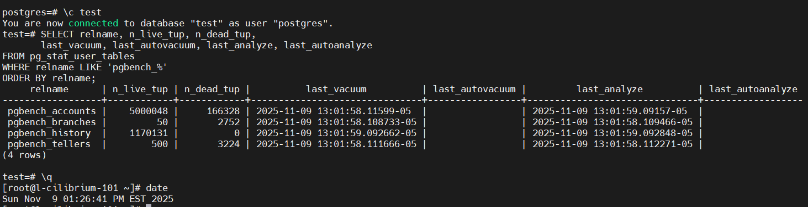

```А вот тут уже когда он более агрессивный. Здесь мы видим что он работает```       
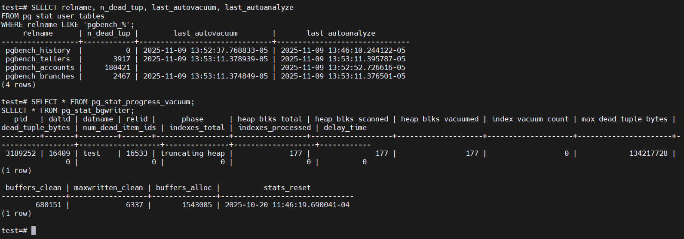

<b>Что можно сказать по результатам pgbench?</b> Что автовакуум немного замедляет TPS в момент своей работы и увеличивает немного latensy, но это не особо критично для работы, и можно сделать вывод что без автовакуума не обойтись, как не обойтись и без авто analyze (так как он обновляет статистику для планировщика запросов).

- Создаем таблицу на 1 млн. строк

```
-- текст будет не пустой, чтобы обновления вызывали реальный рост
CREATE TABLE public.demo_bloat (
  id  bigint PRIMARY KEY,
  txt text NOT NULL
);
```

```Наполняем данными```     

```
-- 1 млн строк
INSERT INTO public.demo_bloat (id, txt)
SELECT g, md5(random()::text)      -- 32 символа
       || md5(random()::text)      -- +32
       || md5(random()::text)      -- +32 (итого ~96)
FROM generate_series(1, 1000000) AS g;

ANALYZE public.demo_bloat;
```
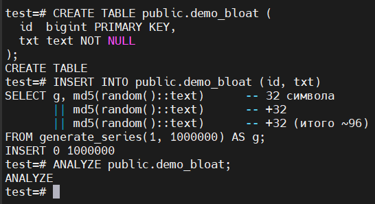

Напоминаю что, ```ANALYZE``` надо делать всегда после крупных вставок для обновления статистики.

- Просмотр размера таблицы
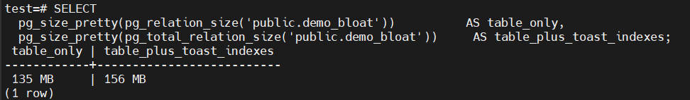

- 5 раз обновить все строчки и добавить к каждой строчке любой символ
```
DO $$
BEGIN
  FOR i IN 1..5 LOOP
    UPDATE public.demo_bloat
       SET txt = txt || 'X';
    -- полезно фиксировать прогресс
    RAISE NOTICE 'update pass % done', i;
  END LOOP;
END$$;
```
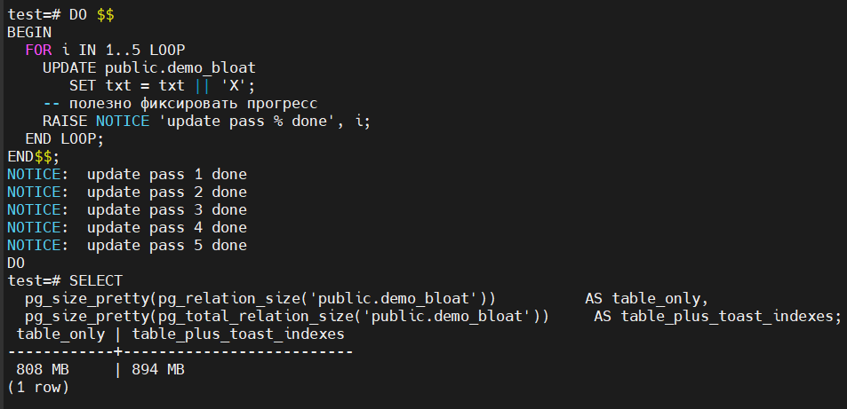

- Посмотреть автовакуум и размер таблиц
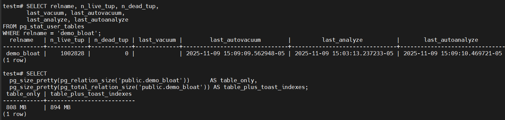

Можем также посмотреть и процент занятого места в таблице
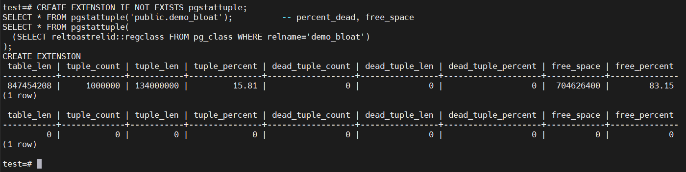

- Еще 5 массовых обновлений
```
DO $$
BEGIN
  FOR i IN 1..5 LOOP
    UPDATE public.demo_bloat
       SET txt = txt || 'Y';
    RAISE NOTICE 'update pass (phase2) % done', i;
  END LOOP;
END$$;
```
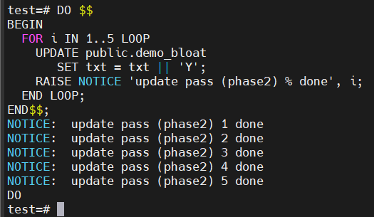

Далее смотрим размер и когда приходил автовакуум
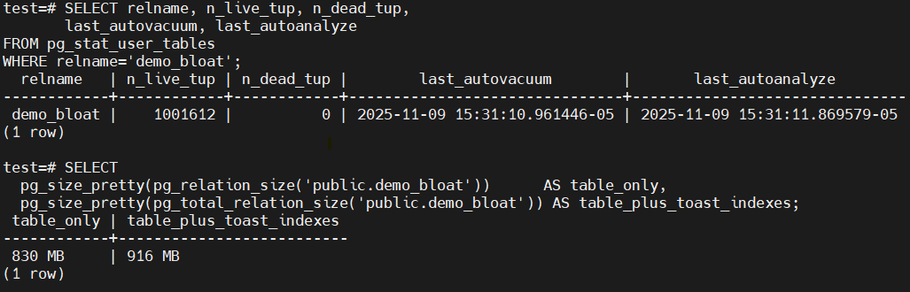

И смотрим свободное место в таблице
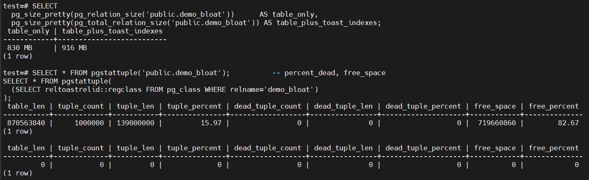

- Отключаем авто вакуум на таблице

```
ALTER TABLE public.demo_bloat SET (autovacuum_enabled = off);
```

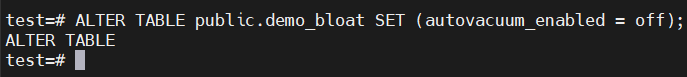

- 10 раз обновить все строчки и добавить к каждой строчке любой символ

```
DO $$
BEGIN
  FOR i IN 1..10 LOOP
    UPDATE public.demo_bloat
       SET txt = txt || 'Z';
    RAISE NOTICE 'update pass (no av) % done', i;
  END LOOP;
END$$;

-- статистика и размер
SELECT relname, n_live_tup, n_dead_tup,
       last_autovacuum, last_autoanalyze
FROM pg_stat_user_tables
WHERE relname='demo_bloat';

SELECT
  pg_size_pretty(pg_relation_size('public.demo_bloat'))      AS table_only,
  pg_size_pretty(pg_total_relation_size('public.demo_bloat')) AS table_plus_toast_indexes;

-- Посмотреть свободное место в таблице (нужно заранее создавать расширение командой CREATE EXTENSION IF NOT EXISTS pgstattuple;)
SELECT * FROM pgstattuple('public.demo_bloat');          -- percent_dead, free_space
SELECT * FROM pgstattuple(
  (SELECT reltoastrelid::regclass FROM pg_class WHERE relname='demo_bloat')
);
```

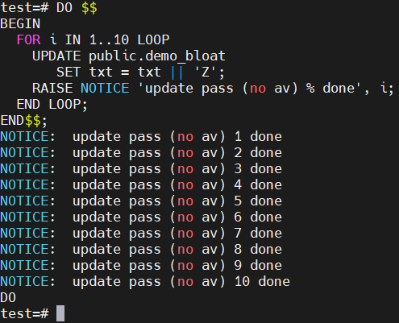

- Посмотреть размер файла с таблицей

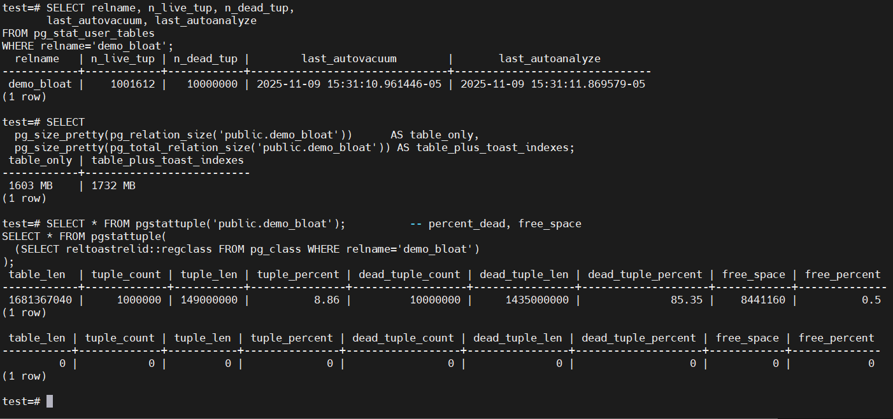

### Итого:
- После каждой волны UPDATE создаются новые версии строк (MVCC). Старые версии становятся dead tuples.

Пока autovacuum работает, он:
- удаляет dead tuples,
- помечает страницы как пригодные к повторному использованию,
- иногда уменьшает n_dead_tup,
- но размер файла часто не уменьшается (страницы остаются у таблицы до VACUUM FULL). Зато свободное место внутри файла повторно используется под будущие вставки/обновления.
- С включённым autovacuum: n_dead_tup будет периодически падать, а рост pg_total_relation_size замедлится.
- С отключённым autovacuum: n_dead_tup растёт, pg_total_relation_size увеличивается быстрее (особенно TOAST), TPS/latency в реальной нагрузке со временем ухудшаются.