## Домашнее задание № 7
### Название урока: Работа с журналами

Цель:
- уметь работать с журналами и контрольными точками
- уметь настраивать параметры журналов

### Описание/Пошаговая инструкция выполнения домашнего задания:
- Настройте выполнение контрольной точки раз в 30 секунд.
- 10 минут c помощью утилиты pgbench подавайте нагрузку.
- Измерьте, какой объем журнальных файлов был сгенерирован за это время.  
- Оцените, какой объем приходится в среднем на одну контрольную точку.
- Проверьте данные статистики: все ли контрольные точки выполнялись точно по расписанию. Почему так произошло?
- Сравните tps в синхронном/асинхронном режиме утилитой pgbench. Объясните полученный результат.
- Создайте новый кластер с включенной контрольной суммой страниц. Создайте таблицу. Вставьте несколько значений. Выключите кластер. Измените пару байт в таблице. Включите кластер и сделайте выборку из таблицы. Что и почему произошло? как проигнорировать ошибку и продолжить работу?

### Выполнение домашнего задания

- Настройте выполнение контрольной точки раз в 30 секунд
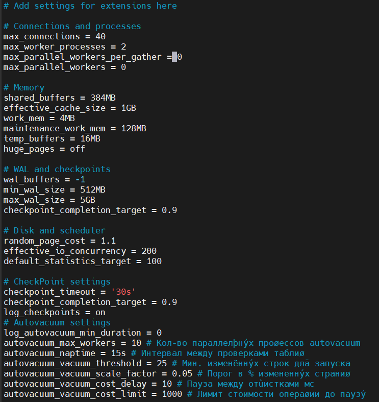

- 10 минут c помощью утилиты pgbench подавайте нагрузку

```Определение LSN до теста```        
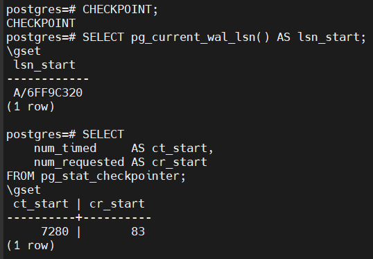
```
-- LSN начала
SELECT pg_current_wal_lsn() AS lsn_start;
\gset

-- счётчики чекпоинтов
SELECT
    num_timed     AS ct_start,
    num_requested AS cr_start
FROM pg_stat_checkpointer;
\gset
```

```Отключение autovacuum```       
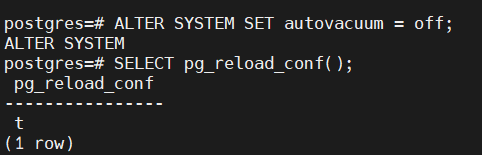
```
ALTER SYSTEM SET autovacuum = off;
SELECT pg_reload_conf();
```

```Нагрузочное тестирование```
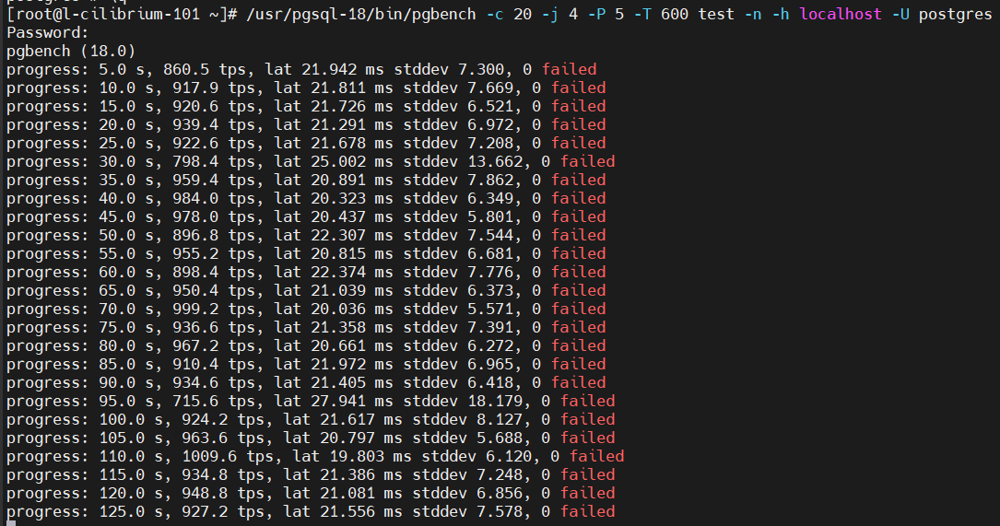

```
/usr/pgsql-18/bin/pgbench -c 20 -j 4 -P 5 -T 600 test -n -h localhost -U postgres
Password:
pgbench (18.0)
progress: 5.0 s, 860.5 tps, lat 21.942 ms stddev 7.300, 0 failed
progress: 10.0 s, 917.9 tps, lat 21.811 ms stddev 7.669, 0 failed
progress: 15.0 s, 920.6 tps, lat 21.726 ms stddev 6.521, 0 failed
progress: 20.0 s, 939.4 tps, lat 21.291 ms stddev 6.972, 0 failed
progress: 25.0 s, 922.6 tps, lat 21.678 ms stddev 7.208, 0 failed
progress: 30.0 s, 798.4 tps, lat 25.002 ms stddev 13.662, 0 failed
progress: 35.0 s, 959.4 tps, lat 20.891 ms stddev 7.862, 0 failed
progress: 40.0 s, 984.0 tps, lat 20.323 ms stddev 6.349, 0 failed
progress: 45.0 s, 978.0 tps, lat 20.437 ms stddev 5.801, 0 failed
progress: 50.0 s, 896.8 tps, lat 22.307 ms stddev 7.544, 0 failed
progress: 55.0 s, 955.2 tps, lat 20.815 ms stddev 6.681, 0 failed
progress: 60.0 s, 898.4 tps, lat 22.374 ms stddev 7.776, 0 failed
progress: 65.0 s, 950.4 tps, lat 21.039 ms stddev 6.373, 0 failed
progress: 70.0 s, 999.2 tps, lat 20.036 ms stddev 5.571, 0 failed
progress: 75.0 s, 936.6 tps, lat 21.358 ms stddev 7.391, 0 failed
progress: 80.0 s, 967.2 tps, lat 20.661 ms stddev 6.272, 0 failed
progress: 85.0 s, 910.4 tps, lat 21.972 ms stddev 6.965, 0 failed
progress: 90.0 s, 934.6 tps, lat 21.405 ms stddev 6.418, 0 failed
progress: 95.0 s, 715.6 tps, lat 27.941 ms stddev 18.179, 0 failed
progress: 100.0 s, 924.2 tps, lat 21.617 ms stddev 8.127, 0 failed
progress: 105.0 s, 963.6 tps, lat 20.797 ms stddev 5.688, 0 failed
progress: 110.0 s, 1009.6 tps, lat 19.803 ms stddev 6.120, 0 failed
progress: 115.0 s, 934.8 tps, lat 21.386 ms stddev 7.248, 0 failed
progress: 120.0 s, 948.8 tps, lat 21.081 ms stddev 6.856, 0 failed
progress: 125.0 s, 927.2 tps, lat 21.556 ms stddev 7.578, 0 failed
progress: 130.0 s, 949.8 tps, lat 21.037 ms stddev 7.216, 0 failed
progress: 135.0 s, 922.8 tps, lat 21.677 ms stddev 6.138, 0 failed
progress: 140.0 s, 845.2 tps, lat 23.651 ms stddev 8.938, 0 failed
progress: 145.0 s, 694.8 tps, lat 28.835 ms stddev 11.133, 0 failed
progress: 150.0 s, 985.4 tps, lat 20.280 ms stddev 5.297, 0 failed
progress: 155.0 s, 645.8 tps, lat 30.990 ms stddev 17.654, 0 failed
progress: 160.0 s, 1007.2 tps, lat 19.840 ms stddev 5.483, 0 failed
progress: 165.0 s, 959.6 tps, lat 20.825 ms stddev 6.182, 0 failed
progress: 170.0 s, 925.2 tps, lat 21.608 ms stddev 7.621, 0 failed
progress: 175.0 s, 946.0 tps, lat 21.177 ms stddev 6.133, 0 failed
progress: 180.0 s, 932.4 tps, lat 21.433 ms stddev 7.028, 0 failed
progress: 185.0 s, 924.4 tps, lat 21.660 ms stddev 7.107, 0 failed
progress: 190.0 s, 970.2 tps, lat 20.617 ms stddev 7.096, 0 failed
progress: 195.0 s, 985.6 tps, lat 20.286 ms stddev 5.817, 0 failed
progress: 200.0 s, 910.2 tps, lat 21.962 ms stddev 7.738, 0 failed
progress: 205.0 s, 959.6 tps, lat 20.846 ms stddev 6.343, 0 failed
progress: 210.0 s, 1057.2 tps, lat 18.931 ms stddev 5.648, 0 failed
progress: 215.0 s, 797.0 tps, lat 25.071 ms stddev 13.745, 0 failed
progress: 220.0 s, 975.6 tps, lat 20.497 ms stddev 5.790, 0 failed
progress: 225.0 s, 981.6 tps, lat 20.387 ms stddev 6.631, 0 failed
progress: 230.0 s, 946.4 tps, lat 21.131 ms stddev 6.033, 0 failed
progress: 235.0 s, 908.4 tps, lat 22.026 ms stddev 8.465, 0 failed
progress: 240.0 s, 886.8 tps, lat 22.535 ms stddev 7.724, 0 failed
progress: 245.0 s, 913.4 tps, lat 21.887 ms stddev 7.295, 0 failed
progress: 250.0 s, 867.8 tps, lat 23.066 ms stddev 7.795, 0 failed
progress: 255.0 s, 930.0 tps, lat 21.501 ms stddev 6.568, 0 failed
progress: 260.0 s, 976.4 tps, lat 20.472 ms stddev 5.916, 0 failed
progress: 265.0 s, 935.0 tps, lat 21.397 ms stddev 7.080, 0 failed
progress: 270.0 s, 941.2 tps, lat 21.241 ms stddev 6.394, 0 failed
progress: 275.0 s, 885.6 tps, lat 22.537 ms stddev 9.634, 0 failed
progress: 280.0 s, 816.0 tps, lat 24.558 ms stddev 12.196, 0 failed
progress: 285.0 s, 864.8 tps, lat 23.150 ms stddev 7.844, 0 failed
progress: 290.0 s, 996.6 tps, lat 20.052 ms stddev 6.068, 0 failed
progress: 295.0 s, 935.2 tps, lat 21.397 ms stddev 7.504, 0 failed
progress: 300.0 s, 967.6 tps, lat 20.639 ms stddev 7.798, 0 failed
progress: 305.0 s, 886.4 tps, lat 22.572 ms stddev 7.811, 0 failed
progress: 310.0 s, 941.2 tps, lat 21.247 ms stddev 6.913, 0 failed
progress: 315.0 s, 940.6 tps, lat 21.273 ms stddev 6.396, 0 failed
progress: 320.0 s, 925.6 tps, lat 21.590 ms stddev 7.439, 0 failed
progress: 325.0 s, 949.2 tps, lat 21.099 ms stddev 6.707, 0 failed
progress: 330.0 s, 833.0 tps, lat 23.988 ms stddev 8.084, 0 failed
progress: 335.0 s, 877.8 tps, lat 22.801 ms stddev 6.922, 0 failed
progress: 340.0 s, 709.8 tps, lat 28.157 ms stddev 16.203, 0 failed
progress: 345.0 s, 879.4 tps, lat 22.744 ms stddev 8.529, 0 failed
progress: 350.0 s, 956.4 tps, lat 20.917 ms stddev 7.552, 0 failed
progress: 355.0 s, 911.6 tps, lat 21.856 ms stddev 8.010, 0 failed
progress: 360.0 s, 921.6 tps, lat 21.771 ms stddev 7.206, 0 failed
progress: 365.0 s, 915.8 tps, lat 21.846 ms stddev 7.917, 0 failed
progress: 370.0 s, 927.4 tps, lat 21.539 ms stddev 6.420, 0 failed
progress: 375.0 s, 854.8 tps, lat 23.435 ms stddev 9.741, 0 failed
progress: 380.0 s, 937.8 tps, lat 21.330 ms stddev 6.547, 0 failed
progress: 385.0 s, 918.6 tps, lat 21.764 ms stddev 7.318, 0 failed
progress: 390.0 s, 913.6 tps, lat 21.897 ms stddev 6.851, 0 failed
progress: 395.0 s, 828.4 tps, lat 24.059 ms stddev 8.681, 0 failed
progress: 400.0 s, 746.4 tps, lat 26.854 ms stddev 15.003, 0 failed
progress: 405.0 s, 882.4 tps, lat 22.675 ms stddev 7.710, 0 failed
progress: 410.0 s, 932.8 tps, lat 21.457 ms stddev 6.349, 0 failed
progress: 415.0 s, 879.2 tps, lat 22.732 ms stddev 6.640, 0 failed
progress: 420.0 s, 908.4 tps, lat 22.019 ms stddev 7.093, 0 failed
progress: 425.0 s, 908.6 tps, lat 21.994 ms stddev 7.358, 0 failed
progress: 430.0 s, 910.8 tps, lat 21.961 ms stddev 9.305, 0 failed
progress: 435.0 s, 1014.0 tps, lat 19.728 ms stddev 5.821, 0 failed
progress: 440.0 s, 976.8 tps, lat 20.478 ms stddev 5.855, 0 failed
progress: 445.0 s, 966.0 tps, lat 20.678 ms stddev 6.578, 0 failed
progress: 450.0 s, 968.8 tps, lat 20.669 ms stddev 6.128, 0 failed
progress: 455.0 s, 963.2 tps, lat 20.761 ms stddev 6.609, 0 failed
progress: 460.0 s, 794.0 tps, lat 25.150 ms stddev 13.418, 0 failed
progress: 465.0 s, 943.6 tps, lat 21.234 ms stddev 9.010, 0 failed
progress: 470.0 s, 1008.8 tps, lat 19.802 ms stddev 6.058, 0 failed
progress: 475.0 s, 895.2 tps, lat 22.366 ms stddev 8.117, 0 failed
progress: 480.0 s, 919.2 tps, lat 21.760 ms stddev 7.098, 0 failed
progress: 485.0 s, 835.4 tps, lat 23.943 ms stddev 8.083, 0 failed
progress: 490.0 s, 880.8 tps, lat 22.694 ms stddev 7.768, 0 failed
progress: 495.0 s, 935.8 tps, lat 21.367 ms stddev 7.410, 0 failed
progress: 500.0 s, 872.0 tps, lat 22.927 ms stddev 8.208, 0 failed
progress: 505.0 s, 972.0 tps, lat 20.517 ms stddev 5.776, 0 failed
progress: 510.0 s, 962.6 tps, lat 20.850 ms stddev 7.184, 0 failed
progress: 515.0 s, 929.8 tps, lat 21.514 ms stddev 7.481, 0 failed
progress: 520.0 s, 958.8 tps, lat 20.856 ms stddev 6.082, 0 failed
progress: 525.0 s, 654.8 tps, lat 30.516 ms stddev 23.054, 0 failed
progress: 530.0 s, 922.8 tps, lat 21.682 ms stddev 6.610, 0 failed
progress: 535.0 s, 938.4 tps, lat 21.332 ms stddev 7.241, 0 failed
progress: 540.0 s, 943.0 tps, lat 21.185 ms stddev 6.120, 0 failed
progress: 545.0 s, 952.0 tps, lat 21.011 ms stddev 5.801, 0 failed
progress: 550.0 s, 864.0 tps, lat 23.123 ms stddev 7.877, 0 failed
progress: 555.0 s, 933.6 tps, lat 21.423 ms stddev 6.868, 0 failed
progress: 560.0 s, 932.2 tps, lat 21.481 ms stddev 6.069, 0 failed
progress: 565.0 s, 960.8 tps, lat 20.809 ms stddev 6.710, 0 failed
progress: 570.0 s, 872.0 tps, lat 22.921 ms stddev 7.720, 0 failed
progress: 575.0 s, 933.2 tps, lat 21.453 ms stddev 6.169, 0 failed
progress: 580.0 s, 903.8 tps, lat 22.134 ms stddev 8.528, 0 failed
progress: 585.0 s, 754.6 tps, lat 26.410 ms stddev 14.376, 0 failed
progress: 590.0 s, 860.2 tps, lat 23.296 ms stddev 8.828, 0 failed
progress: 595.0 s, 931.6 tps, lat 21.486 ms stddev 6.504, 0 failed
progress: 600.0 s, 959.6 tps, lat 20.823 ms stddev 6.790, 0 failed
transaction type: <builtin: TPC-B (sort of)>
scaling factor: 50
query mode: simple
number of clients: 20
number of threads: 4
maximum number of tries: 1
duration: 600 s
number of transactions actually processed: 548076
number of failed transactions: 0 (0.000%)
latency average = 21.885 ms
latency stddev = 8.222 ms
initial connection time = 263.154 ms
tps = 913.782360 (without initial connection time)
```

```WAL и checkpoint после теста```
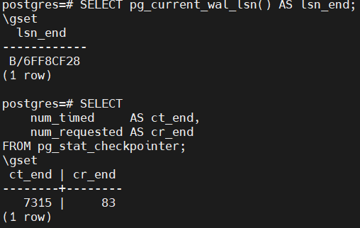


- Измерьте, какой объем журнальных файлов был сгенерирован за это время

```Объём сгенерированного WAL```
```
SELECT
  pg_wal_lsn_diff('B/6FF8CF28', 'A/6FF9C320')::bigint AS wal_bytes,
  pg_size_pretty(pg_wal_lsn_diff('B/6FF8CF28', 'A/6FF9C320')) AS wal_pretty;
```
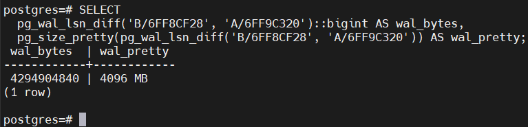

Объем 4 ГБ.

```Сколько чекпоинтов было?```
```
SELECT
  (7315 - 7280) + (83 - 83) AS checkpoints;
```
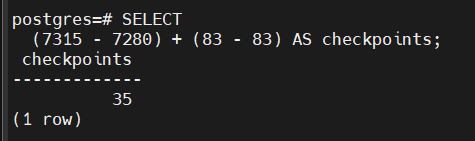

```Средний объём WAL на один чекпоинт```
```
SELECT
  pg_wal_lsn_diff('B/6FF8CF28','A/6FF9C320')::bigint              AS wal_bytes,
  (7315 - 7280) + (83 - 83)                                       AS checkpoints,
  pg_wal_lsn_diff('B/6FF8CF28','A/6FF9C320')
    / ((7315 - 7280) + (83 - 83))                                 AS bytes_per_checkpoint,
  pg_size_pretty(
    pg_wal_lsn_diff('B/6FF8CF28','A/6FF9C320')
    / ((7315 - 7280) + (83 - 83))
  )                                                               AS avg_wal_per_checkpoint;
```

- Оцените, какой объем приходится в среднем на одну контрольную точку

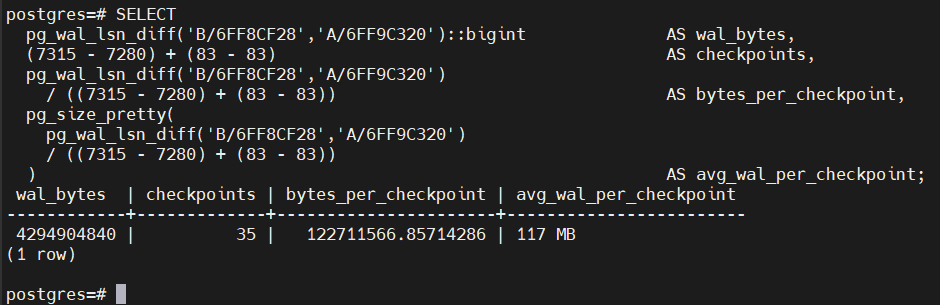

Краткий вывод:

- За 10 минут теста pgbench сгенерировалось ≈ 4 ГБ WAL.
- За тот же период произошло 35 чекпоинтов, все по таймеру (num_timed рос, num_requested нет).
- В среднем на один чекпоинт пришлось ≈ 117 МБ WAL.

- Проверьте данные статистики: все ли контрольные точки выполнялись точно по расписанию. Почему так произошло?

```
SELECT
    num_timed,
    num_requested,
    stats_reset
FROM pg_stat_checkpointer;
```

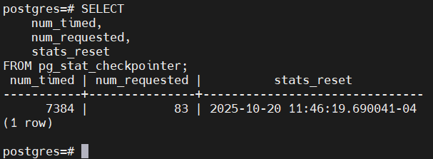

- num_timed — количество чекпоинтов, которые произошли по таймауту (checkpoint_timeout).
- stats_reset - дата последнего сброса статистики
- num_requested — чекпоинты, вызванные раньше времени, потому что:
1. достигнут max_wal_size,
2. была команда CHECKPOINT,
3. была внутренняя потребность ядра.

Судя по собранным данным:
- было: 7280 timed, 83 requested
- стало: 7315 timed, 83 requested

Это не означает, что они шли строго каждые 30 секунд. Это означает только то, что они были запущены по таймауту, но не обязательно завершились ровно через 30 секунд.

```
checkpoint_timeout = 30s
checkpoint_completion_target = 0.9
```
Параметр checkpoint_completion_target будет стараться растянуть сброс грязных страниц на 90% интервала, то есть примерно на 27 секунд, чтобы не создать резкий всплеск I/O. 

Если слишком много страниц грязные, то чекпоинт может длиться дольше, чем 30 секунд

И тогда следующий чекпоинт стартует не в момент окончания прошлого, а когда истечёт checkpoint_timeout с момента начала прошлого.

Также чекпоинты могут нагладываться друг на друга при сильной нагрузке.

Параметр checkpoint_timeout не регулирует длительность чекпоинта, он регулирует максимальный интервал запуска между чекпоинтами. 

- Сравните tps в синхронном/асинхронном режиме утилитой pgbench. Объясните полученный результат

```Активация асинхронного режима```


```Второе тестирование в асинхронном режиме```
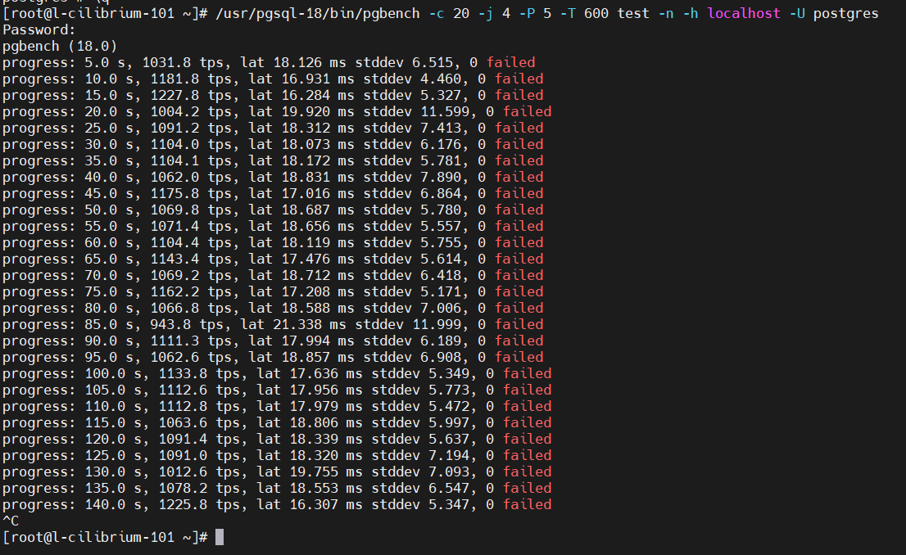

Вообщем из второго теста видно, что результаты стали лучше. Сервер обрабатывает больше транзакций в секунду. Но за счет того что на PostgreSQL не записывает каждую транзакцию в WAL файл и не теряет на время, а данные хранятся в оперативной памяти. Этот режим нельзя включать на проде, за счет того что при сбое потеряются данные из оперативной памяти и которые еще не записаны в WAL журнал. В синхронном режиме сервер на каждую транзакцию делает fsync и реально записывает транзакцию и только потом отдает клиенту ОК. Это дает гарантию, что данные не потеряются.

- Создайте новый кластер с включенной контрольной суммой страниц. Создайте таблицу. Вставьте несколько значений. Выключите кластер. Измените пару байт в таблице. Включите кластер и сделайте выборку из таблицы. Что и почему произошло? как проигнорировать ошибку и продолжить работу?

1. Создаем новую директорию под новый инстанс ```mkdir -p /mnt/newdisk/data-checksum-cluster```
2. Даем права ```chown postgres:postgres /mnt/newdisk/data-checksum-cluster``` и ```chmod 700 /mnt/newdisk/data-checksum-cluster```
3. Заходим под postgres ```sudo -iu postgres```
4. Инициализируем новый кластер (инстанс) ```/usr/pgsql-18/bin/initdb /mnt/newdisk/data-checksum-cluster/ --data-checksums```


5. Запускаем кластер с контрольными суммами ```/usr/pgsql-18/bin/pg_ctl -D /mnt/newdisk/data-checksum-cluster/ -o "-p 5433" -l /mnt/newdisk/data-checksum-cluster/logfile start```

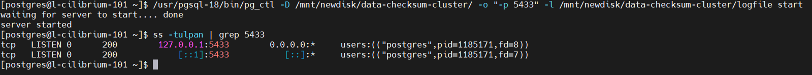

6. Проверяем настройку контрольных сумм ```psql -p 5433 -d postgres``` и ```SHOW data_checksums;```

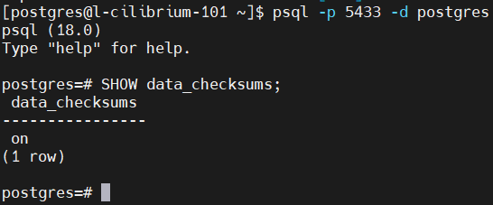

7. Добавляем данные и смотрим где физически они находятся 

```
CREATE TABLE demo_corrupt(id int primary key, payload text);
INSERT INTO demo_corrupt VALUES (1,'alpha'),(2,'beta'),(3,'gamma');
CHECKPOINT;
SELECT pg_relation_filepath('public.demo_corrupt'); # или SELECT pg_relation_filenode('public.demo_corrupt');
```
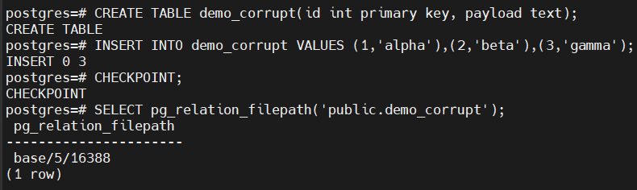

8. Останавливаем кластер ```/usr/pgsql-18/bin/pg_ctl -D /mnt/newdisk/data-checksum-cluster/ -o "-p 5433" -l /mnt/newdisk/data-checksum-cluster/logfile stop```

9. Портим файл (испортим несколько байт в первом блоке)

```
FILE="/mnt/newdisk/data-checksum-cluster/base/5/16388"
printf '\x00\xFF\x00\xFF' | dd of="$FILE" bs=1 seek=100 conv=notrunc
```

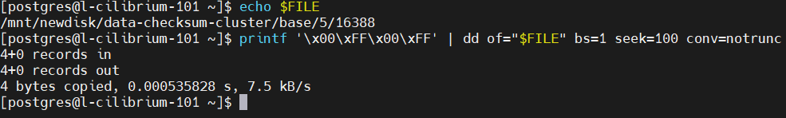

10. Снова запускаем кластер ```/usr/pgsql-18/bin/pg_ctl -D /mnt/newdisk/data-checksum-cluster/ -o "-p 5433" -l /mnt/newdisk/data-checksum-cluster/logfile start```

11. Заходим в него и выполняем SELECT поврежденной таблицы

```
psql -p 5433 -d postgres
SELECT * FROM demo_corrupt;
```

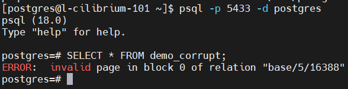

12. Проигнорировать ошибку можно двумя путями:

```
-- вариант 1: игнорируем ошибки контрольных сумм (опасно: читаем "битые" данные)
SET ignore_checksum_failure = on;
SELECT * FROM demo_corrupt;

-- вариант 2: затираем повреждённые страницы нулями (безопаснее для движка, но данные в блоке теряются)
SET zero_damaged_pages = on;
SELECT * FROM demo_corrupt;
```

Результат двух команд:

Игнорируем ошибки.

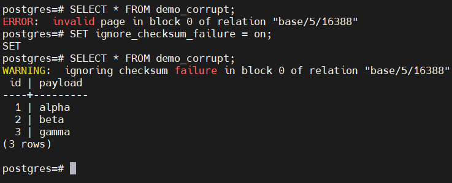

Затираем поврежденные страницы нулями.

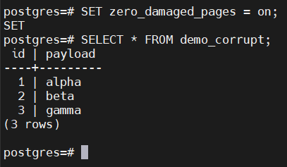


Исправить проблему фундаментально можно путем восстановления таблицы из резервной копии.