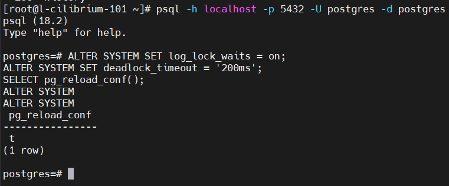
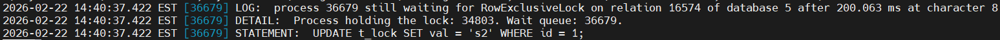
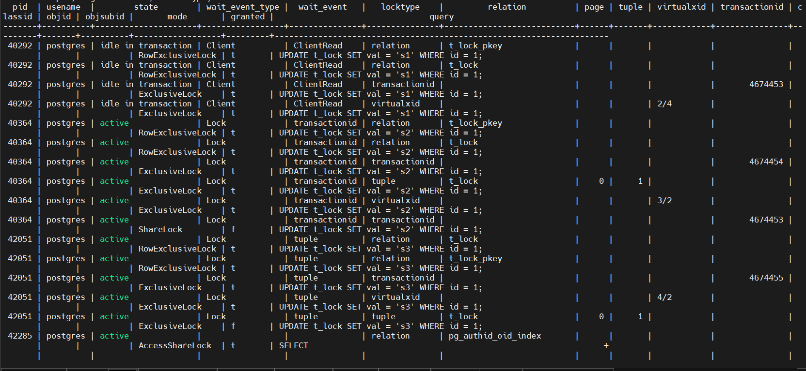
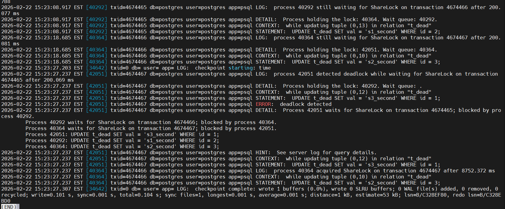
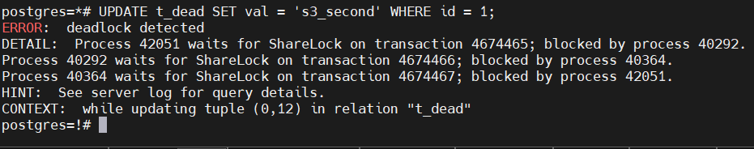
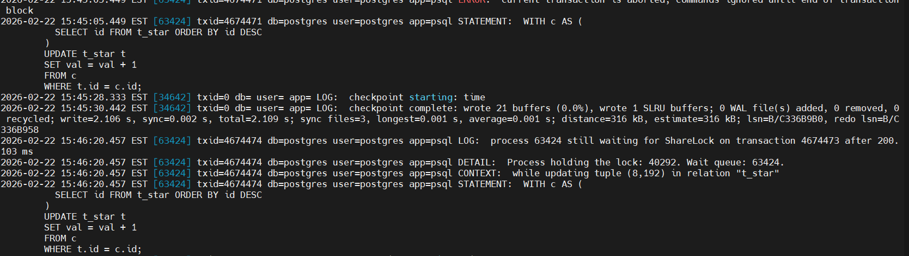
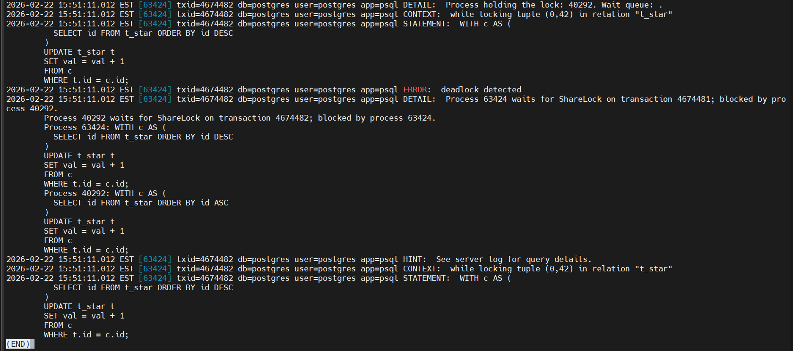
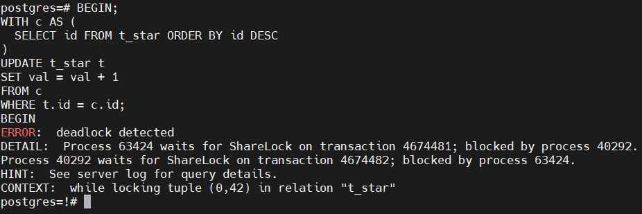

## Домашнее задание № 8
### Название урока: Блокировки

Цель:
- понять как работают блокировки
- научиться находить проблемные места
- понимать как работает механизм блокировок объектов и строк

### Описание/Пошаговая инструкция выполнения домашнего задания:
- Настройте сервер так, чтобы в журнал сообщений сбрасывалась информация о блокировках, удерживаемых более 200 миллисекунд. Воспроизведите ситуацию, при которой в журнале появятся такие сообщения.
- Смоделируйте ситуацию обновления одной и той же строки тремя командами UPDATE в разных сеансах. Изучите возникшие блокировки в представлении pg_locks и убедитесь, что все они понятны. Пришлите список блокировок и объясните, что значит каждая.
- Воспроизведите взаимоблокировку трех транзакций. Можно ли разобраться в ситуации постфактум, изучая журнал сообщений?
- Могут ли две транзакции, выполняющие единственную команду UPDATE одной и той же таблицы (без where), заблокировать друг друга?
- Задание со звездочкой*
  Попробуйте воспроизвести такую ситуацию.


### Выполнение домашнего задания

1. Настройте сервер так, чтобы в журнал сообщений сбрасывалась информация о блокировках, удерживаемых более 200 миллисекунд. Воспроизведите ситуацию, при которой в журнале появятся такие сообщения.

```Логирование блокировок дольше 200 мс (включение)```      

```
ALTER SYSTEM SET log_lock_waits = on;
ALTER SYSTEM SET deadlock_timeout = '200ms';
SELECT pg_reload_conf();
```



```Сеанс 1```

```
DROP TABLE IF EXISTS t_lock;
CREATE TABLE t_lock(id int primary key, val text);
INSERT INTO t_lock VALUES (1, 'a');

BEGIN;
UPDATE t_lock SET val = 's1' WHERE id = 1;
-- транзакцию НЕ коммитим, держим блокировку
```

```Сеанс 2```

```
BEGIN;
UPDATE t_lock SET val = 's2' WHERE id = 1;
-- здесь будет ждать блокировку > 200 мс
```

```Результат видим в лог файле```     



2. Смоделируйте ситуацию обновления одной и той же строки тремя командами UPDATE в разных сеансах. Изучите возникшие блокировки в представлении pg_locks и убедитесь, что все они понятны. Пришлите список блокировок и объясните, что значит каждая.

Подготовка:

```
TRUNCATE t_lock;
INSERT INTO t_lock VALUES (1, 'init');
```

Сеанс 1

```
BEGIN;
UPDATE t_lock SET val = 's1' WHERE id = 1;
-- не коммитим
```

Сеанс 2

```
BEGIN;
UPDATE t_lock SET val = 's2' WHERE id = 1;
-- ждет завершения сеанса 1
```

Сеанс 3

```
BEGIN;
UPDATE t_lock SET val = 's3' WHERE id = 1;
-- тоже ждет
```

Смотрим блокировки:

```
SELECT
    a.pid,
    a.usename,
    a.state,
    a.wait_event_type,
    a.wait_event,
    l.locktype,
    l.relation::regclass AS relation,
    l.page,
    l.tuple,
    l.virtualxid,
    l.transactionid,
    l.classid,
    l.objid,
    l.objsubid,
    l.mode,
    l.granted,
    a.query
FROM pg_locks l
JOIN pg_stat_activity a ON a.pid = l.pid
WHERE a.datname = current_database()
  AND (a.query ILIKE '%t_lock%' OR l.relation = 't_lock'::regclass)
ORDER BY a.pid, l.granted DESC, l.locktype;
```

Результат



Объяснение:

```
В эксперименте три сеанса выполняли UPDATE одной и той же строки t_lock(id=1).
Первый сеанс (PID 40292) успешно обновил строку и остался в состоянии idle in transaction, удерживая:

RowExclusiveLock на таблице t_lock,

RowExclusiveLock на индексе t_lock_pkey,

ExclusiveLock на transactionid (XID своей транзакции),

ExclusiveLock на virtualxid.

Второй сеанс (PID 40364) выполнял UPDATE той же строки и перешел в ожидание (wait_event_type = Lock, wait_event = transactionid).
В pg_locks у него виден невыданный (granted = f) ShareLock на transactionid = 4674453, что означает ожидание завершения транзакции первого сеанса.

Третий сеанс (PID 42051) также выполнял UPDATE той же строки и ожидал блокировку строки (wait_event = tuple).
В pg_locks у него виден невыданный (granted = f) tuple ExclusiveLock на строку (page=0, tuple=1) таблицы t_lock.

Таким образом, подтверждено, что при конфликте UPDATE одной и той же строки PostgreSQL использует как табличные блокировки (RowExclusiveLock), так и ожидания по transactionid и tuple, в зависимости от стадии обработки.

При конфликте UPDATE по одной строке PostgreSQL:

- смотрит версию строки,

- видит, что она изменена незавершенной транзакцией,

- ждет завершения транзакции-владельца версии (через transactionid lock).

То есть ожидание часто видно как locktype = transactionid, а не как “row lock” в привычном смысле.

```

3. Воспроизведите взаимоблокировку трех транзакций. Можно ли разобраться в ситуации постфактум, изучая журнал сообщений?

Подготовка

```
DROP TABLE IF EXISTS t_dead;
CREATE TABLE t_dead(id int primary key, val text);
INSERT INTO t_dead VALUES
(1,'a'),(2,'b'),(3,'c');
```

Сеанс 1

```
BEGIN;
UPDATE t_dead SET val='s1' WHERE id=1; # Выполнить в первый круг
-- потом:
UPDATE t_dead SET val='s1' WHERE id=2;  # Выполнить во второй круг -- будет ждать (если id=2 уже захвачен сеансом 2)
```

Сеанс 2

```
BEGIN;
UPDATE t_dead SET val='s2' WHERE id=2; # Выполнить в первый круг
-- потом:
UPDATE t_dead SET val='s2' WHERE id=3;  # Выполнить во второй круг -- будет ждать (если id=3 уже захвачен сеансом 3)
```

Сеанс 3

```
BEGIN;
UPDATE t_dead SET val='s3' WHERE id=3; # Выполнить в первый круг
-- потом:
UPDATE t_dead SET val='s3' WHERE id=1;  # Выполнить во второй круг -- будет ждать (id=1 у сеанса 1)
```

```
Теперь вернуться:

в сеанс 1 выполнит UPDATE ... id=2

в сеанс 2 выполнит UPDATE ... id=3

в сеанс 3 выполнит UPDATE ... id=1

Получится цикл:

S1 ждет S2

S2 ждет S3

S3 ждет S1

PostgreSQL обнаружит deadlock и одну транзакцию отменит с ошибкой:
ERROR: deadlock detected
```

Результат

В логе:



В консоли:



Сам PostgreSQL разрывает взаимные блокировки по своему усмотрению.

4. Могут ли две транзакции, выполняющие единственную команду UPDATE одной и той же таблицы (без where), заблокировать друг друга?
  Задание со звездочкой*
  Попробуйте воспроизвести такую ситуацию.

Ответ: Да, могут при определенных условиях

```
Каждый UPDATE без WHERE проходит по множеству строк.
Если две транзакции начинают обновлять одну и ту же таблицу в разном порядке доступа к строкам, возможна ситуация:

Т1 уже обновила строку A, хочет B

Т2 уже обновила строку B, хочет A

=> взаимоблокировка.

Но есть нюанс

Если обе транзакции идут по строкам в одном и том же порядке, чаще будет просто ожидание, а не deadlock.

Для воспроизведения deadlock обычно нужно добиться разного порядка обхода строк, например:

разные планы выполнения (seq scan vs index scan)

разные индексы/условия

ORDER BY в подзапросе (обновление через CTE)

триггеры, которые обновляют связанные таблицы/строки в разном порядке
```

Как воспроизвести?

```
DROP TABLE IF EXISTS t_star;
CREATE TABLE t_star(id int primary key, val int);
INSERT INTO t_star
SELECT i, 0 FROM generate_series(1, 1000) AS i;
```

Сеанс 1 (обновление по возрастанию)

```
BEGIN;
WITH c AS (
  SELECT id FROM t_star ORDER BY id ASC
)
UPDATE t_star t
SET val = val + 1
FROM c
WHERE t.id = c.id;
```

Сеанс 2 (обновление по убыванию)

```
BEGIN;
WITH c AS (
  SELECT id FROM t_star ORDER BY id DESC
)
UPDATE t_star t
SET val = val + 1
FROM c
WHERE t.id = c.id;
```



Это все таки не взаимная блокировка, а блокировка ожидания.

Усложним, чтобы добиться именно взаимной блокировки.

```
Самый надежный способ — замедлить обработку строк, чтобы обе транзакции успели “перехватить” разные части таблицы и встретиться.

Создаем таблицу и триггер, который чуть тормозит каждую строку при UPDATE. Тогда два UPDATE с разным порядком гораздо чаще дают deadlock.
```

Подготовка

```
DROP TABLE IF EXISTS t_star CASCADE;
CREATE TABLE t_star(id int PRIMARY KEY, val int);
INSERT INTO t_star
SELECT i, 0 FROM generate_series(1, 50) AS i;

CREATE OR REPLACE FUNCTION slow_update_trigger()
RETURNS trigger AS $$
BEGIN
  PERFORM pg_sleep(0.02); -- 20 мс на строку
  RETURN NEW;
END;
$$ LANGUAGE plpgsql;

CREATE TRIGGER trg_slow_update
BEFORE UPDATE ON t_star
FOR EACH ROW
EXECUTE FUNCTION slow_update_trigger();
```

Сеанс 1

```
BEGIN;
WITH c AS (
  SELECT id FROM t_star ORDER BY id ASC
)
UPDATE t_star t
SET val = val + 1
FROM c
WHERE t.id = c.id;
```

Сеанс 2 (почти сразу после старта сеанса 1)

```
BEGIN;
WITH c AS (
  SELECT id FROM t_star ORDER BY id DESC
)
UPDATE t_star t
SET val = val + 1
FROM c
WHERE t.id = c.id;
```

Результат, видим deadlock







#### Ключевые выводы

```
1. log_lock_waits = on + deadlock_timeout = 200ms позволяют диагностировать долгие ожидания блокировок.

2. UPDATE одной строки не блокирует всю таблицу целиком для DML, а в основном конфликтует по строке/транзакции.

3. В pg_locks важно смотреть не только tuple, но и transactionid, так как ожидание часто идет именно по завершению чужой транзакции.

4. Deadlock можно воспроизвести как для нескольких точечных UPDATE, так и для двух UPDATE без WHERE при разном порядке обработки строк.

Журнал PostgreSQL позволяет разобрать deadlock постфактум.
```