## Домашнее задание № 9
### Название урока: Выборка данных, виды join'ов. Применение и оптимизация

Цель:
- знать и уметь применять различные виды join'ов
- строить и анализировать план выполенения запроса
- оптимизировать запрос
- уметь собирать и анализировать статистику для таблицы

В результате выполнения ДЗ вы научитесь пользоваться
различными вариантами соединения таблиц.

### Описание/Пошаговая инструкция выполнения домашнего задания:
Необходимо:
- Реализовать прямое соединение двух или более таблиц
- Реализовать левостороннее (или правостороннее)
соединение двух или более таблиц
- Реализовать кросс соединение двух или более таблиц
- Реализовать полное соединение двух или более таблиц
- Реализовать запрос, в котором будут использованы
разные типы соединений
- Сделать комментарии на каждый запрос
- К работе приложить структуру таблиц, для которых
выполнялись соединения
Задание со звездочкой*
Придумайте 3 своих метрики на основе показанных представлений, отправьте их через ЛК, а так же поделитесь с коллегами в слаке


### Выполнение домашнего задания

#### Структура таблиц

Подключаемся к PostgreSQL: ```sudo -u postgres psql```

Создаем БД и подключаемся к ней: ```CREATE DATABASE shop;``` и ```\c shop;```

Ниже пример небольшой предметной области интернет-магазина:

- customers — клиенты

- orders — заказы

- order_items — позиции в заказе

- products — товары

- categories — категории товаров

- payments — оплаты (не у всех заказов может быть оплата)

```
-- Таблица клиентов
CREATE TABLE customers (
    customer_id   BIGSERIAL PRIMARY KEY,
    full_name     TEXT NOT NULL,
    email         TEXT UNIQUE NOT NULL,
    city          TEXT,
    created_at    TIMESTAMP NOT NULL DEFAULT now()
);

-- Таблица категорий товаров
CREATE TABLE categories (
    category_id    BIGSERIAL PRIMARY KEY,
    category_name  TEXT NOT NULL UNIQUE
);

-- Таблица товаров
CREATE TABLE products (
    product_id     BIGSERIAL PRIMARY KEY,
    product_name   TEXT NOT NULL,
    category_id    BIGINT REFERENCES categories(category_id),
    price          NUMERIC(12,2) NOT NULL CHECK (price >= 0),
    is_active      BOOLEAN NOT NULL DEFAULT true
);

-- Таблица заказов
CREATE TABLE orders (
    order_id       BIGSERIAL PRIMARY KEY,
    customer_id    BIGINT NOT NULL REFERENCES customers(customer_id),
    order_date     DATE NOT NULL DEFAULT CURRENT_DATE,
    status         TEXT NOT NULL CHECK (status IN ('new', 'paid', 'shipped', 'cancelled'))
);

-- Таблица позиций заказа (многие-ко-многим между orders и products)
CREATE TABLE order_items (
    order_item_id  BIGSERIAL PRIMARY KEY,
    order_id       BIGINT NOT NULL REFERENCES orders(order_id) ON DELETE CASCADE,
    product_id     BIGINT NOT NULL REFERENCES products(product_id),
    quantity       INTEGER NOT NULL CHECK (quantity > 0),
    unit_price     NUMERIC(12,2) NOT NULL CHECK (unit_price >= 0)
);

-- Таблица оплат (может не быть оплаты на заказ)
CREATE TABLE payments (
    payment_id      BIGSERIAL PRIMARY KEY,
    order_id        BIGINT NOT NULL REFERENCES orders(order_id),
    payment_date    TIMESTAMP NOT NULL DEFAULT now(),
    amount          NUMERIC(12,2) NOT NULL CHECK (amount >= 0),
    payment_method  TEXT NOT NULL CHECK (payment_method IN ('card', 'cash', 'sbp')),
    status          TEXT NOT NULL CHECK (status IN ('pending', 'success', 'failed'))
);
```

Тестовые данные, чтобы запросы возвращали результат

```
INSERT INTO categories (category_name) VALUES
('Ноутбуки'),
('Мониторы'),
('Аксессуары');

INSERT INTO customers (full_name, email, city) VALUES
('Иван Петров', 'ivan@example.com', 'Москва'),
('Анна Смирнова', 'anna@example.com', 'Санкт-Петербург'),
('Олег Сидоров', 'oleg@example.com', 'Казань');

INSERT INTO products (product_name, category_id, price, is_active) VALUES
('Lenovo ThinkPad', 1, 120000, true),
('Dell UltraSharp 27', 2, 45000, true),
('Logitech Mouse', 3, 2500, true),
('Old Monitor', 2, 10000, false);

INSERT INTO orders (customer_id, order_date, status) VALUES
(1, CURRENT_DATE - 5, 'paid'),
(1, CURRENT_DATE - 1, 'new'),
(2, CURRENT_DATE - 2, 'shipped');

INSERT INTO order_items (order_id, product_id, quantity, unit_price) VALUES
(1, 1, 1, 120000),
(1, 3, 2, 2500),
(2, 2, 1, 45000),
(3, 3, 3, 2500);

INSERT INTO payments (order_id, payment_date, amount, payment_method, status) VALUES
(1, now() - interval '5 day', 125000, 'card', 'success'),
(3, now() - interval '2 day', 7500, 'sbp', 'success');
-- Для заказа 2 оплаты пока нет (новый заказ)
```

#### Реализовать прямое соединение двух или более таблиц

```
-- INNER JOIN: покажем заказы с клиентами.
-- Возвращаются только те строки, где найдено соответствие customer_id в обеих таблицах.
SELECT
    o.order_id,
    o.order_date,
    o.status,
    c.customer_id,
    c.full_name,
    c.city
FROM orders o
INNER JOIN customers c ON c.customer_id = o.customer_id
ORDER BY o.order_id;
```

- INNER JOIN возвращает только совпадающие записи.

- Если у заказа есть клиент — строка попадет в результат.

- Если бы в orders были “битые” ссылки (без FK) — такие строки не попали бы.

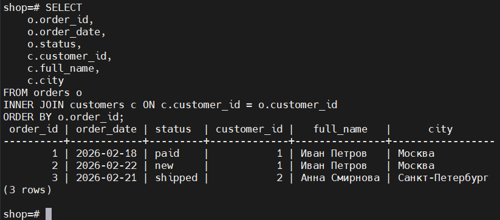

```INNER JOIN (3+ таблицы)```

```
-- INNER JOIN нескольких таблиц:
-- показываем состав заказа: заказ -> клиент -> позиции -> товар
SELECT
    o.order_id,
    c.full_name AS customer_name,
    p.product_name,
    oi.quantity,
    oi.unit_price,
    oi.quantity * oi.unit_price AS line_total
FROM orders o
INNER JOIN customers c   ON c.customer_id = o.customer_id
INNER JOIN order_items oi ON oi.order_id = o.order_id
INNER JOIN products p     ON p.product_id = oi.product_id
ORDER BY o.order_id, p.product_name;
```

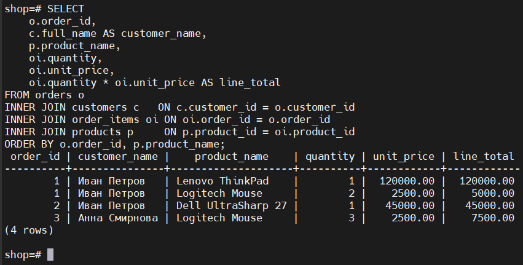

#### Реализовать левостороннее (или правостороннее) соединение двух или более таблиц

```
-- LEFT JOIN: покажем все заказы и информацию об оплате (если она есть).
-- Заказы без оплаты тоже попадут в результат, а поля payment будут NULL.
SELECT
    o.order_id,
    o.order_date,
    o.status AS order_status,
    p.payment_id,
    p.amount,
    p.status AS payment_status
FROM orders o
LEFT JOIN payments p ON p.order_id = o.order_id
ORDER BY o.order_id;
```

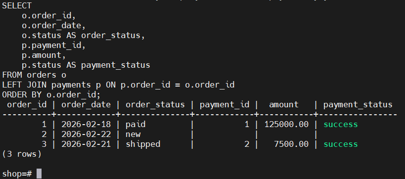


- LEFT JOIN возвращает все строки из левой таблицы (orders).

- Если справа (payments) совпадения нет — поля справа будут NULL.

- Это удобно для поиска “неоплаченных заказов”.

```Пример поиска отсутствующих записей через LEFT JOIN```

```
-- Найдем заказы, по которым еще нет успешной оплаты
SELECT
    o.order_id,
    o.order_date,
    o.status
FROM orders o
LEFT JOIN payments p
    ON p.order_id = o.order_id
   AND p.status = 'success'
WHERE p.payment_id IS NULL
ORDER BY o.order_id;
```

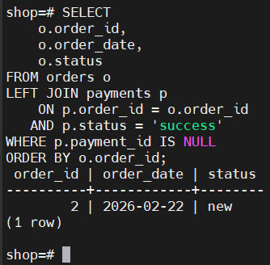

- Условие p.status = 'success' вынесено в ON, чтобы сохранить смысл LEFT JOIN.

- WHERE p.payment_id IS NULL отбирает строки, где успешной оплаты нет.

```RIGHT JOIN (для демонстрации)```

```
-- RIGHT JOIN: тот же смысл, но "все строки из правой таблицы".
-- На практике чаще используют LEFT JOIN (он читается проще).
SELECT
    c.customer_id,
    c.full_name,
    o.order_id,
    o.order_date
FROM orders o
RIGHT JOIN customers c ON c.customer_id = o.customer_id
ORDER BY c.customer_id, o.order_id;
```

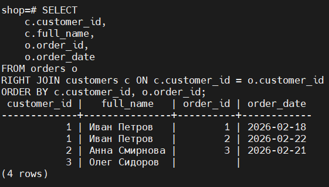

- RIGHT JOIN логически эквивалентен LEFT JOIN, если поменять таблицы местами.

- Обычно в реальных проектах предпочитают LEFT JOIN.

#### Реализовать кросс соединение двух или более таблиц

```
-- CROSS JOIN: декартово произведение.
-- Каждая категория будет соединена с каждым городом клиентов.
-- (Пример учебный; в реальной жизни использовать осторожно!)
SELECT
    cat.category_name,
    c.city
FROM categories cat
CROSS JOIN (
    SELECT DISTINCT city
    FROM customers
    WHERE city IS NOT NULL
) c
ORDER BY cat.category_name, c.city;
```

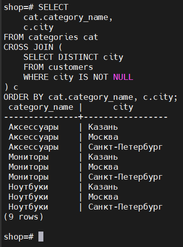

- CROSS JOIN возвращает все возможные комбинации строк.

- Если в одной таблице 3 строки, а в другой 5 — будет 15 строк.

- Полезно для генерации матриц, календарей, комбинаций параметров.

#### Реализовать полное соединение двух или более таблиц (FULL JOIN)

```
-- FULL JOIN: покажем соответствия между заказами и оплатами,
-- включая "лишние" строки с обеих сторон (если бы они были).
SELECT
    o.order_id,
    o.status AS order_status,
    p.payment_id,
    p.status AS payment_status,
    p.amount
FROM orders o
FULL JOIN payments p ON p.order_id = o.order_id
ORDER BY COALESCE(o.order_id, p.order_id), p.payment_id;
```

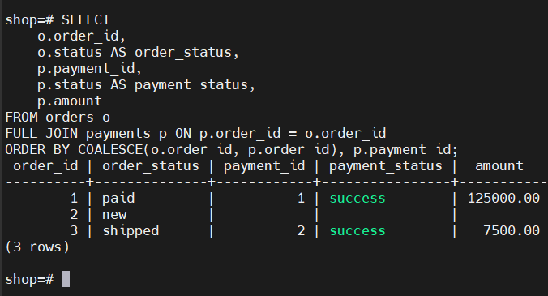

**FULL JOIN возвращает:**

- совпавшие строки,

- строки только из левой таблицы,

- строки только из правой таблицы.

- Практически используется реже, но полезен для сверок/аудита.

#### Реализовать запрос, в котором будут использованы разные типы соединений

```
-- Смешанный запрос: INNER + LEFT + LEFT
-- Покажем заказ, клиента, сумму заказа по позициям и успешную оплату (если есть).
SELECT
    o.order_id,
    o.order_date,
    c.full_name AS customer_name,
    c.city,
    SUM(oi.quantity * oi.unit_price) AS order_total,
    p.amount AS paid_amount,
    p.payment_method,
    p.status AS payment_status
FROM orders o
INNER JOIN customers c
    ON c.customer_id = o.customer_id
INNER JOIN order_items oi
    ON oi.order_id = o.order_id
LEFT JOIN payments p
    ON p.order_id = o.order_id
   AND p.status = 'success'
GROUP BY
    o.order_id, o.order_date, c.full_name, c.city,
    p.amount, p.payment_method, p.status
ORDER BY o.order_id;
```

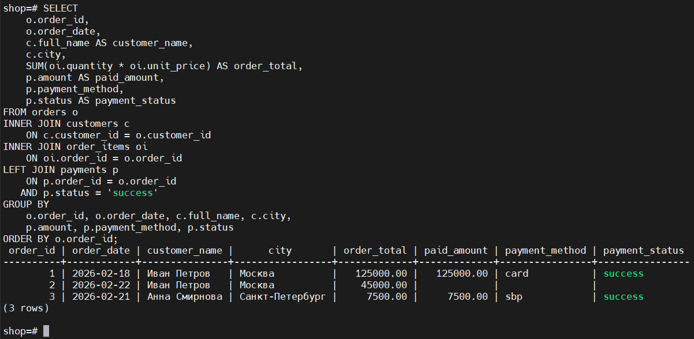

- INNER JOIN с customers и order_items — обязательные сущности.

- LEFT JOIN с payments — оплата может отсутствовать.

- Агрегация (SUM) считает сумму заказа.

Это пример реального аналитического запроса.

#### План выполнения запроса (EXPLAIN / EXPLAIN ANALYZE)

```Пример: анализ смешанного запроса```

```
EXPLAIN (ANALYZE, BUFFERS, VERBOSE)
SELECT
    o.order_id,
    o.order_date,
    c.full_name AS customer_name,
    SUM(oi.quantity * oi.unit_price) AS order_total
FROM orders o
JOIN customers c ON c.customer_id = o.customer_id
JOIN order_items oi ON oi.order_id = o.order_id
GROUP BY o.order_id, o.order_date, c.full_name
ORDER BY o.order_id;
```

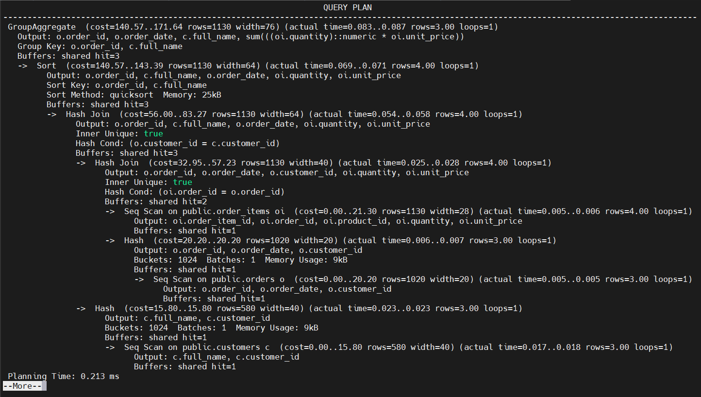

**Что смотреть в плане**

- Seq Scan — последовательное чтение таблицы (нормально для маленьких таблиц).

- Index Scan / Bitmap Index Scan — использование индекса.

- Hash Join / Nested Loop / Merge Join — тип соединения.

- Actual time — фактическое время выполнения.

- Rows — сколько строк ожидал/получил планировщик.

- Buffers — работа с памятью/диском.

#### Оптимизация запроса (пример)

```
-- Индексы для ускорения JOIN и фильтрации
CREATE INDEX IF NOT EXISTS idx_orders_customer_id
    ON orders(customer_id);

CREATE INDEX IF NOT EXISTS idx_order_items_order_id
    ON order_items(order_id);

CREATE INDEX IF NOT EXISTS idx_order_items_product_id
    ON order_items(product_id);

CREATE INDEX IF NOT EXISTS idx_payments_order_id
    ON payments(order_id);

CREATE INDEX IF NOT EXISTS idx_payments_order_id_status
    ON payments(order_id, status);
```

**Почему это помогает**

- JOIN’ы выполняются по ключам (customer_id, order_id, product_id).

- Без индексов на больших таблицах PostgreSQL может делать дорогие сканы.

- Композитный индекс (order_id, status) полезен, если вы часто ищете оплату по заказу + статусу (success).

#### Сбор и анализ статистики таблиц

```
-- Обновить статистику по всем таблицам текущей БД
ANALYZE;

-- Или только по конкретной таблице
ANALYZE orders;
ANALYZE order_items;
ANALYZE payments;
```

#### Полезные системные представления для анализа статистики

Статистика по таблицам (pg_stat_user_tables)

```
SELECT
    relname,
    seq_scan,
    seq_tup_read,
    idx_scan,
    idx_tup_fetch,
    n_tup_ins,
    n_tup_upd,
    n_tup_del,
    n_live_tup,
    n_dead_tup,
    last_analyze,
    last_autoanalyze
FROM pg_stat_user_tables
ORDER BY relname;
```

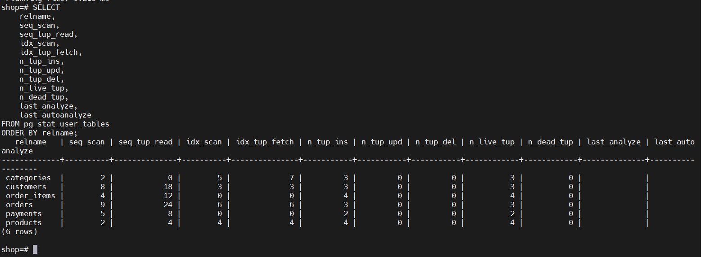

- seq_scan / idx_scan — сколько раз были последовательные/индексные сканы.

- n_dead_tup — “мертвые” строки (важно для VACUUM).

- last_analyze / last_autoanalyze — когда обновлялась статистика.

#### Статистика по индексам (pg_stat_user_indexes)

```
SELECT
    s.relname      AS table_name,
    s.indexrelname AS index_name,
    s.idx_scan,
    s.idx_tup_read,
    s.idx_tup_fetch
FROM pg_stat_user_indexes s
ORDER BY s.relname, s.indexrelname;
```

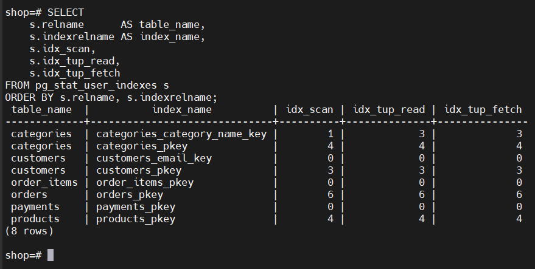

- Показывает, используются ли индексы вообще.

- Если индекс не используется долго — возможно, он лишний.

#### Размеры таблиц и индексов

```
SELECT
    c.relname AS table_name,
    pg_size_pretty(pg_table_size(c.oid))       AS table_size,
    pg_size_pretty(pg_indexes_size(c.oid))     AS indexes_size,
    pg_size_pretty(pg_total_relation_size(c.oid)) AS total_size
FROM pg_class c
JOIN pg_namespace n ON n.oid = c.relnamespace
WHERE c.relkind = 'r'
  AND n.nspname = 'public'
ORDER BY pg_total_relation_size(c.oid) DESC;
```

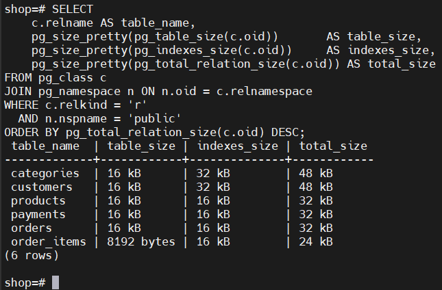

- Помогает понять, что занимает место.

- Полезно для поиска “тяжелых” таблиц.

#### Задание со звездочкой (*) — 3 свои метрики

Ниже 3 метрики на основе стандартных представлений статистики PostgreSQL.

**Метрика 1. Доля индексных сканов по таблице (Index Usage Ratio)**

Идея: понять, насколько таблица читается через индексы, а не seq scan.

```
SELECT
    relname,
    seq_scan,
    idx_scan,
    ROUND(
        CASE
            WHEN (seq_scan + idx_scan) = 0 THEN 0
            ELSE 100.0 * idx_scan / (seq_scan + idx_scan)
        END
    , 2) AS idx_scan_ratio_pct
FROM pg_stat_user_tables
ORDER BY idx_scan_ratio_pct ASC, relname;
```

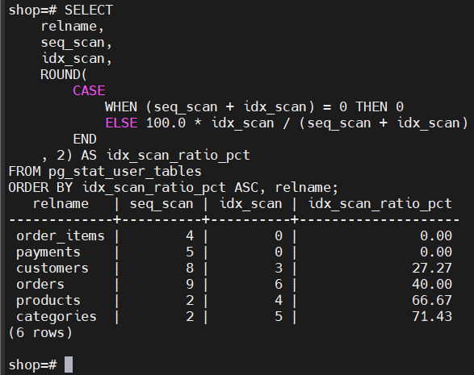

**Низкое значение может означать:**

- таблица маленькая (и это нормально),

- нет нужных индексов,

- запросы написаны так, что индексы не используются.

**Метрика 2. Доля “мертвых” строк (Dead Tuple Ratio)**

Идея: оценить “засоренность” таблицы и необходимость VACUUM.

```
SELECT
    relname,
    n_live_tup,
    n_dead_tup,
    ROUND(
        CASE
            WHEN (n_live_tup + n_dead_tup) = 0 THEN 0
            ELSE 100.0 * n_dead_tup / (n_live_tup + n_dead_tup)
        END
    , 2) AS dead_tuple_ratio_pct,
    last_vacuum,
    last_autovacuum
FROM pg_stat_user_tables
ORDER BY dead_tuple_ratio_pct DESC, relname;
```

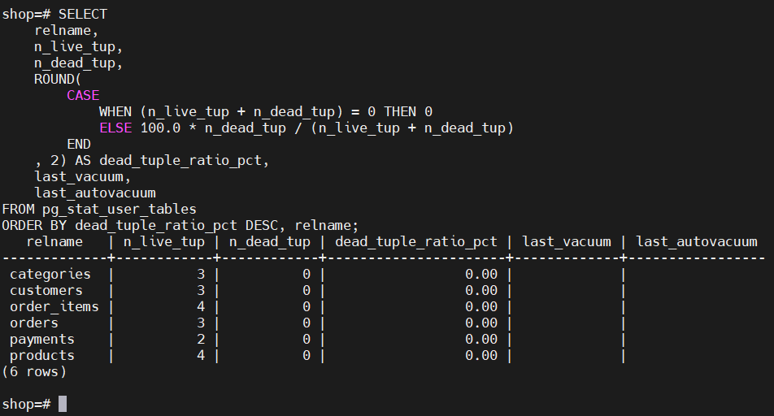

**Что показывает**

- Большая доля n_dead_tup → возможны проблемы:

- autovacuum не успевает,

- много UPDATE/DELETE,

- деградация производительности.

**Метрика 3. Интенсивность изменений таблицы (Write Activity Score)**

Идея: определить “горячие” таблицы по операциям записи.

```
SELECT
    relname,
    n_tup_ins,
    n_tup_upd,
    n_tup_del,
    (n_tup_ins + n_tup_upd + n_tup_del) AS write_activity_score
FROM pg_stat_user_tables
ORDER BY write_activity_score DESC, relname;
```

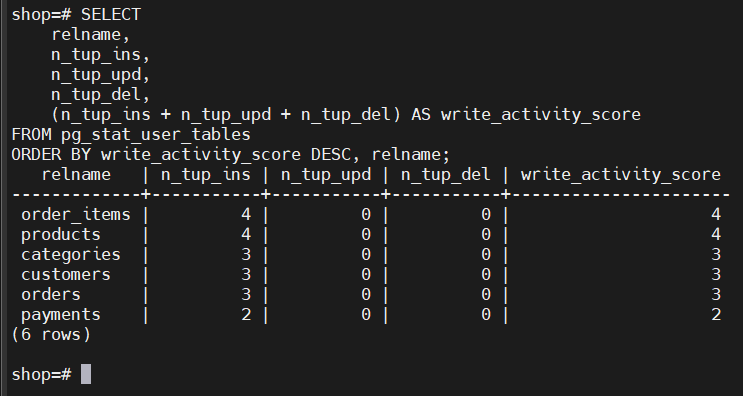

**Что показывает**

- Какие таблицы чаще всего изменяются.

Полезно для:

- настройки autovacuum,

- выбора стратегии индексации,

- оценки нагрузки.

#### Выводы 

1. Были реализованы основные типы соединений: INNER, LEFT/RIGHT, CROSS, FULL, а также запрос с комбинацией нескольких типов JOIN.

2. Для каждого запроса добавлены комментарии с пояснением логики.

3. Показан пример анализа плана выполнения через EXPLAIN (ANALYZE, BUFFERS).

4. Для оптимизации JOIN-запросов предложены индексы по внешним ключам и часто используемым условиям.

5. Рассмотрены системные представления PostgreSQL для анализа статистики таблиц и индексов.

6. Были предложены 3 пользовательские метрики: доля индексных сканов, доля dead tuples, интенсивность записей.