## Проектная работа
### Тема: Создание и тестирование высоконагруженного отказоустойчивого кластера PostgreSQL на базе Patroni

#### Платформа: Яндекс Облако

#### Используемое ПО для развертывания стенда: Terraform, Ansible

#### Состав стенда:
| Тип    | Имя / группа                      | Кол-во | AZ | ОС                  | Назначение                                      | Internal IP / VIP           | Public IP                | Порты / endpoints                                                                     | Примечания                                        |
| ------ | --------------------------------- | -----: | -- | ------------------- | ----------------------------------------------- | --------------------------- | ------------------------ | ------------------------------------------------------------------------------------- | ------------------------------------------------- |
| Ресурс | NLB (Yandex Cloud)                |      1 | ru-central1-a  | —                   | Входная точка, L4 балансировка на HAProxy       | **10.10.10.100**            | —                        | (проброс на HAProxy: 5432/5433/8080)                                                  | Не ВМ                                             |
| Ресурс | NAT Gateway (Yandex Cloud)                |      1 | ru-central1-a  | —                   | Точка выхода в интернет машин без публичного IP       | **10.10.10.100**            | —                        | —                                                  | Не ВМ. Настроена маршрутизация в Яндекс Облаке                                             |
| Ресурс | Подсеть (внутренняя)              |      1 | ru-central1-a  | —                   | Сеть стенда (RFC1918)                           | —            | —                        | —                                                                                     | —                              |
| ВМ     | gui-workstation                   |      1 | ru-central1-a  | **Ubuntu 22.04**    | Управление стендом (GUI/SSH), администрирование | **10.10.10.26**             | **динамический (1 шт.)** | (SSH 22, RDP 3389)                                                                       | При желании — статический public IP               |
| ВМ     | haproxy-1 / haproxy-2             |      2 | ru-central1-a  | **Rocky Linux 9.6** | Балансировка: RW/RO; health-check Patroni       | **10.10.10.31–10.10.10.32** | —                        | **5432 (RW), 5433 (RO), 8080 (status)**                                               | 8080 — просмотр состояния (по твоему описанию)    |
| ВМ     | etcd-1 / etcd-2 / etcd-3          |      3 | ru-central1-a  | **Rocky Linux 9.6** | DCS для Patroni (состояние кластера)            | **10.10.10.11–10.10.10.13** | —                        | **2379 (client), 2380 (peer)**                                                        | Для мониторинга можно добавить node_exporter 9100 |
| ВМ     | pg-node-1 / pg-node-2 / pg-node-3 |      3 | ru-central1-a  | **Rocky Linux 9.6** | Patroni + PostgreSQL (leader/replica)           | **10.10.10.21–10.10.10.23** | —                        | **5432 (PostgreSQL), 8008 (Patroni), 9187 (postgres_exporter)** | 9187 — метрики для Prometheus                |
| ВМ     | monitor-01                        |      1 | ru-central1-a  | **Rocky Linux 9.6** | Мониторинг: Prometheus + Grafana                | **10.10.10.40**             | —                        | **3000 (Grafana), 9090 (Prometheus)**                                                 | —    |


**Итого:**

- ВМ: 10

- Облачные ресурсы: 3 (NLB + NAT Gateway + подсеть)

- Публичные IP: 1 (только gui-workstation)

### Цель проекта

#### Цель:
- Развернуть и протестировать высоконагруженный отказоустойчивый кластер PostgreSQL на базе Patroni в Яндекс Облаке, обеспечив автоматическое переключение ролей (failover), корректную маршрутизацию RW/RO через HAProxy, а также мониторинг состояния кластера и его ключевых метрик.

#### Результат (что считается успехом):

- кластер Patroni+PostgreSQL (3 узла) устойчиво работает и автоматически выполняет failover;

- HAProxy предоставляет 2 точки входа: RW (5432) и RO (5433) и корректно переключает трафик при смене лидера;

- etcd (3 узла) стабильно выполняет роль DCS;

- Prometheus+Grafana отображают состояние кластера БД;

## Этапы выполнения (чек-лист)

### 1) Подготовка инфраструктуры
- [x] Создать внутреннюю подсеть стенда (например, 10.10.10.0/24)
- [x] Развернуть ресурсы: NLB, NAT Gateway и подсеть
- [x] Развернуть ВМ согласно схеме (10 ВМ)
- [x] Настроить базовый доступ (SSH) и правила безопасности (firewall/SG)

### 2) Развёртывание etcd (DCS)
- [x] Установить и настроить кластер etcd (3 ноды)
- [x] Проверить кворум и состояние кластера
- [x] Проверить доступность портов: 2379 (client), 2380 (peer)

### 3) Развёртывание PostgreSQL + Patroni
- [x] Установить PostgreSQL на pg-node-1..3
- [x] Установить и настроить Patroni, подключить к etcd
- [x] Инициализировать кластер (leader + replicas)
- [x] Проверить доступность портов: 5432 (PostgreSQL), 8008 (Patroni API)

### 4) Настройка HAProxy и точек входа RW/RO
- [x] Установить и настроить HAProxy на haproxy-1..2
- [x] Настроить RW endpoint: 5432 (write/read)
- [x] Настроить RO endpoint: 5433 (read-only)
- [x] Настроить health-check по Patroni API (8008)
- [x] Настроить страницу/эндпоинт статуса: 8080
- [x] Подключить NLB к HAProxy (проверить балансировку/доступность)

### 5) Мониторинг (Prometheus + Grafana)
- [x] Развернуть monitor-01 (Prometheus + Grafana)
- [x] Настроить postgres_exporter на pg-нодах (порт 9187)
- [x] Настроить сбор метрик Prometheus (порт 9090)
- [x] Проверить доступность Grafana (порт 3000)
- [x] Добавить дашборды (PostgreSQL/Patroni/host metrics)

### 6) Тестирование отказоустойчивости
- [x] Смоделировать отказ leader (остановка Patroni/PostgreSQL на leader)
- [x] Проверить автоматическое переключение ролей (failover)
- [x] Проверить переключение RW на HAProxy (5432 указывает на нового leader)
- [x] Проверить RO-доступ (5433 читает с реплик)
- [x] Смоделировать отказ 1 ноды etcd и проверить сохранение кворума

### 7) Нагрузочное тестирование
- [x] Провести нагрузочный тест
- [x] Зафиксировать показатели: TPS/latency, CPU/RAM/IO/network, replication lag
- [x] Проанализировать узкие места и подготовить рекомендации

### 8) Документирование результатов
- [x] Оформить схему стенда (состав, роли, порты, IP)
- [x] Описать конфигурацию компонентов (etcd/Patroni/PostgreSQL/HAProxy/Monitoring)
- [x] Сформулировать выводы и дальнейшие улучшения


## Скриншоты

- Как выглядит развернутая инфрастуктура в Яндекс Облаке

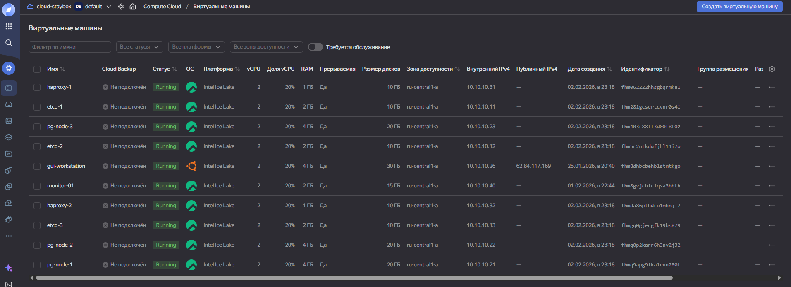

- HAProxy и статус кластера

На этом скриншоте мы видим, что Leader является нода pg-node-1, а Replica являются pg-node-2 и pg-node-3.

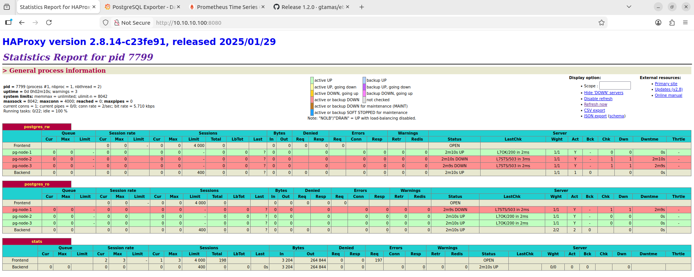

Выполнив команду ```patronictl -c /etc/patroni.yml list``` на одном pg-node-1..3 мы видим следующее

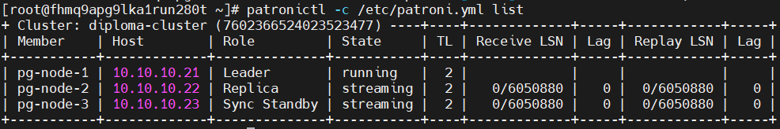

- Etcd кластер

Этот кластер необходим для хранения конфигурации о состоянии кластера Patroni. Посмотреть что именно храниться в etcd можно либо путем командной строки, либо путем скачивания и запуска утилиты ```etcd-manager```. Второй вариант мне показался наиболее предпочтительным.

Здесь мы видим состав кластера

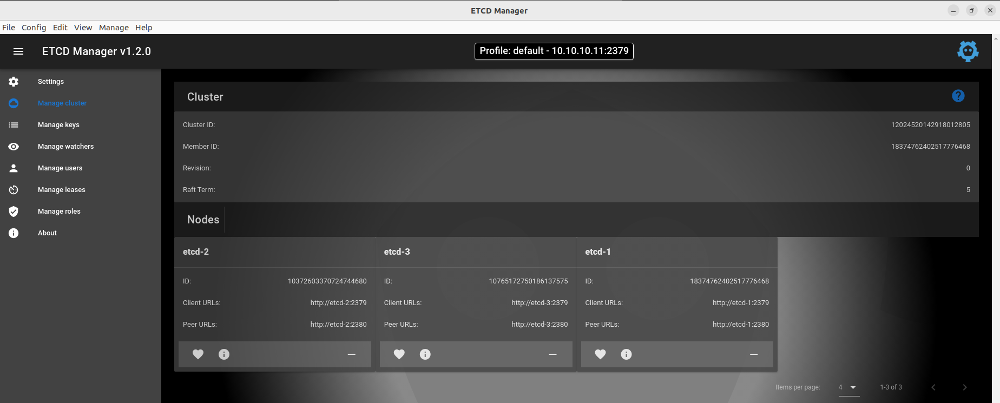

А здесь мы видим данные, которые хранятся в etcd кластере

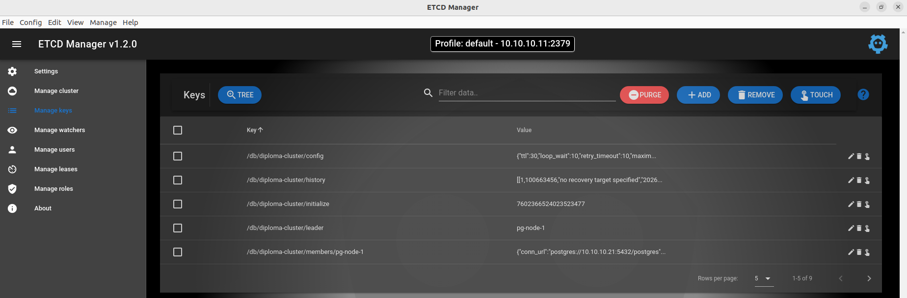

- Prometheus

Это как раз тот компонент который аккумулирует в себе данные которые в нашем случае приходят к нему через экспортеры, которые установлены на нодах pg-node-1..3.

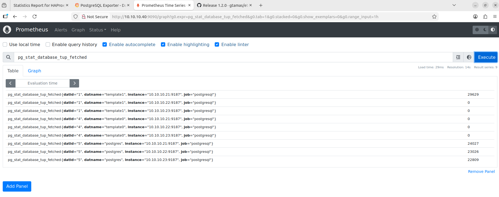

- Grafana

Это веб-дашбоард панель. Сюда можно импортировать шаблоны и более детально их настраивать под свою инфраструктуру.

Вот пример, того шаблона, который взял я.

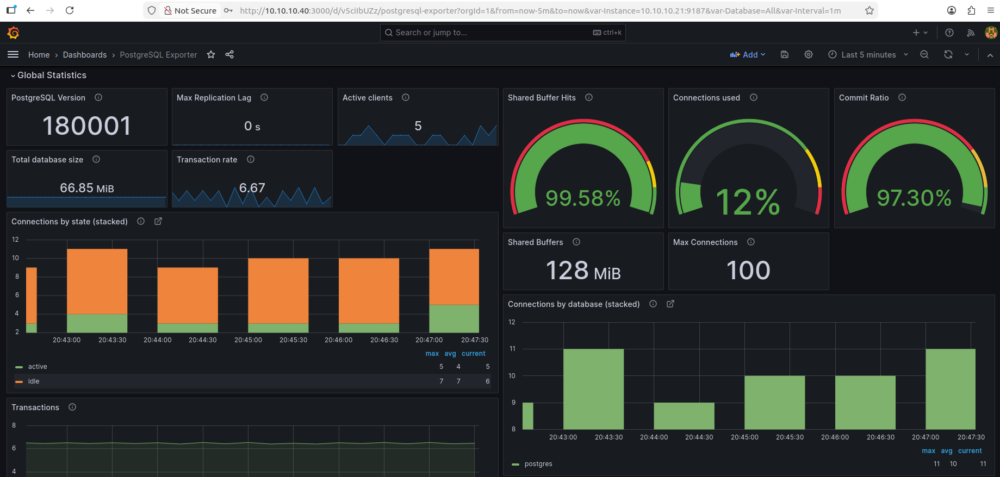

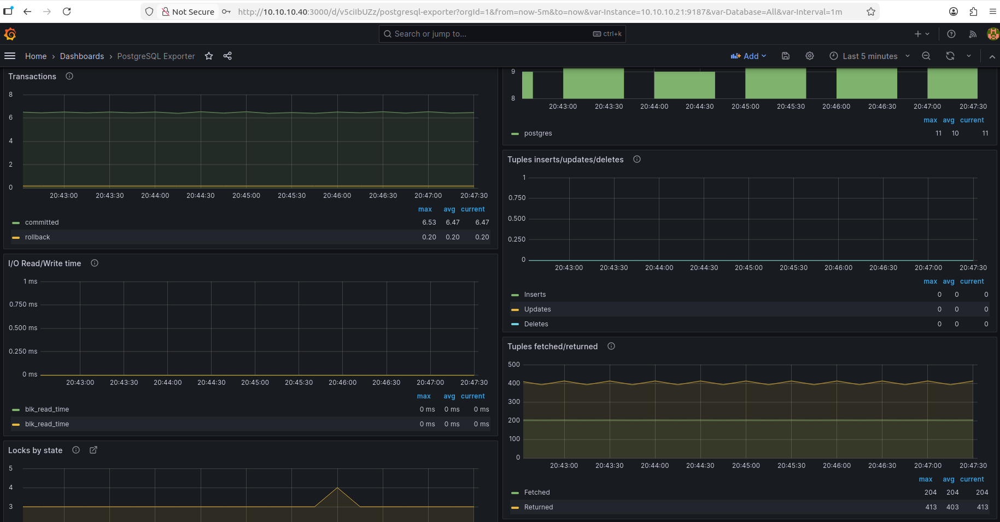

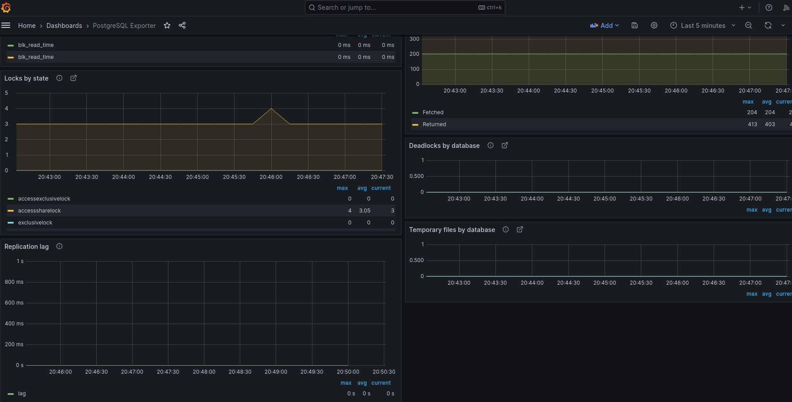

## Как это развернуть?

1. Создаем папку, переходим в нее и далее клонируем репозиторий. 

Команда ```mkdir Andrey.Vanik && cd Andrey.Vanik && git clone https://github.com/staybox/otus-PostgreSQL-2025-09-Andrey.Vanik.git```


2. Сначала нам нужно развернуть инфраструктуру в Яндекс Облаке через terraform. После чего в склонированном репозитории, переходим в папку project и далее terraform. 

После перехода в папку Вам надо будет сделать некоторое количество действий:

а) Создать в папке terraform подпапку vm_keys, куда положить Вами сгенерированные ключи для SSH. Таким образом Вы сможете подключиться к ноде управления (gui-workstation) под пользователем ubuntu, и далее с нее под пользователем rocky к другим машинам без пароля. Терраформ умеет сразу распространять указанные Вами ключи. Еще необходимо в файл ```terraform.tfvars``` **вписать значения**, взятые из Вашего Яндекс Аккаунта.

Команда которая инициализирует проект: ```terraform init```

Команда валидации проекта: ```terraform validate```

Команда планирования (показывает что будет сделано): ```terraform plan```

Команда развертывания проекта: ```terraform apply```

Команда удаления проекта: ```terraform destroy```

Вы также можете выборочно удалять/создавать/пересоздавать сервера и объекты Яндекс Облака. Такими командами как:

```Удаляем выборочно```
```
terraform destroy \
  -target=yandex_compute_instance.etcd \
  -target=yandex_compute_instance.db \
  -target=yandex_compute_instance.haproxy \
  -target=yandex_compute_instance.monitor \
  -target=yandex_lb_network_load_balancer.pg_balancer \
  -target=yandex_lb_target_group.haproxy_nodes
```

```Создаем выборочно```
```
terraform apply \
  -target=yandex_compute_instance.etcd \
  -target=yandex_compute_instance.db \
  -target=yandex_compute_instance.haproxy \
  -target=yandex_compute_instance.monitor \
  -target=yandex_lb_network_load_balancer.pg_balancer \
  -target=yandex_lb_target_group.haproxy_nodes
```

```Сразу пересоздаем выборочно```
```
terraform apply -replace="yandex_compute_instance.etcd" \
                -replace="yandex_compute_instance.db" \
                -replace="yandex_compute_instance.haproxy" \
                -replace="yandex_compute_instance.monitor"
                -replace="yandex_lb_network_load_balancer.pg_balancer" \
                -replace="yandex_lb_target_group.haproxy_nodes"
```

б) После того как сервера будут развернуты в облаке, необходимо будет зайти на ноду управления (gui-workstation) по публичному IP и далее закачать туда Ansible папку, затем зайти в нее и далее на этом сервере запустить раскатку всех компонентов кластера командой ```ansible-playbook -i inventory.ini playbook.yml```. После настройки кластера вы можете под пользователем rocky можете по именам заходить на сервера и смотреть то что Вам интересно.


в) Можете использовать такие команды для того чтобы убедиться кто мастер а кто реплика:

**Leader (мастер) нам вернет f, потому что он не находиться в постоянном восстановлении, как это происходит на репликах**

Порт лидера 5432: ```psql -h 10.10.10.100 -p 5432 -U postgres -d postgres -c "SELECT pg_is_in_recovery();"```

Порт реплик 5433: ```psql -h 10.10.10.100 -p 5433 -U postgres -d postgres -c "SELECT pg_is_in_recovery();"```

Войти под пользователем **postgres**: ```psql -h 10.10.10.100 -p 5432 -U postgres -d postgres```. Пароль: **adminpass**

## Тестирование отказоустойчивости

- Давайте выключим одну из etcd нод и посмотрим как это будет работать

Заходим на etcd-1 по SSH и вводим эти команды. Здесь мы видим момент подключения к серверу, просмотр состояния etcd кластера и далее остановку службы etcd для проверки.

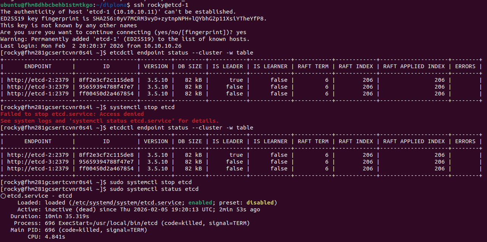

Видим что лидером в кластере etcd стала нода под именем **etcd-2**. Это можно видеть по ее идентификационному номеру.

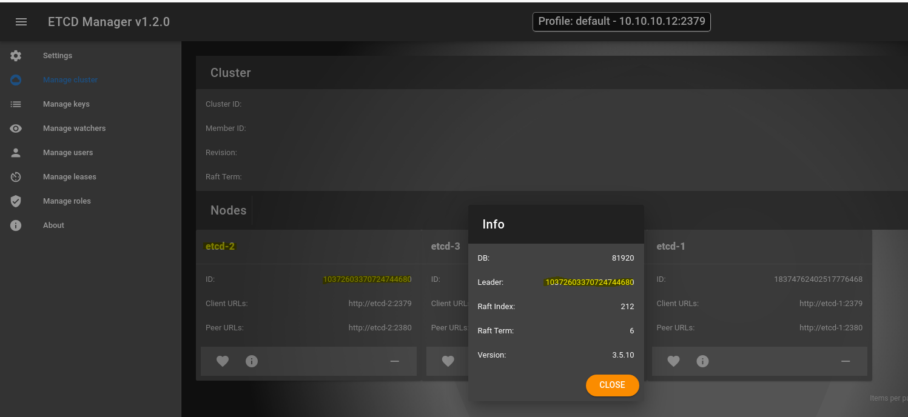

Теперь мы можем зайти на одну из нод Patroni + PostgreSQL и увидеть что кластер жив и здоров, правда ругается на недоступность ноды etcd-1.

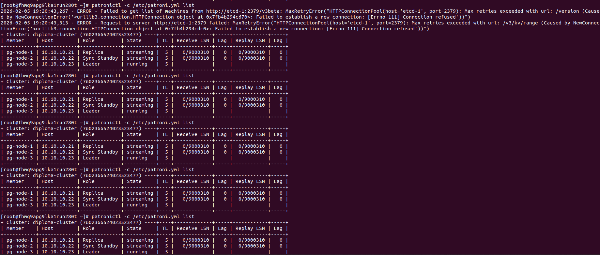

- Давайте теперь сделаем switchover и посмотрим результат этой команды. Выбираем ноду **pg-node-2**.

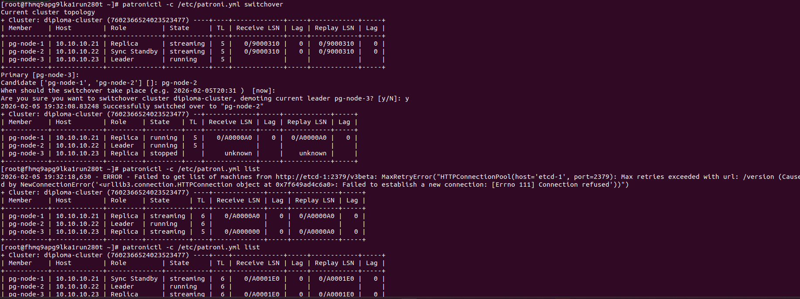

Далее в HAProxy видим также результат.

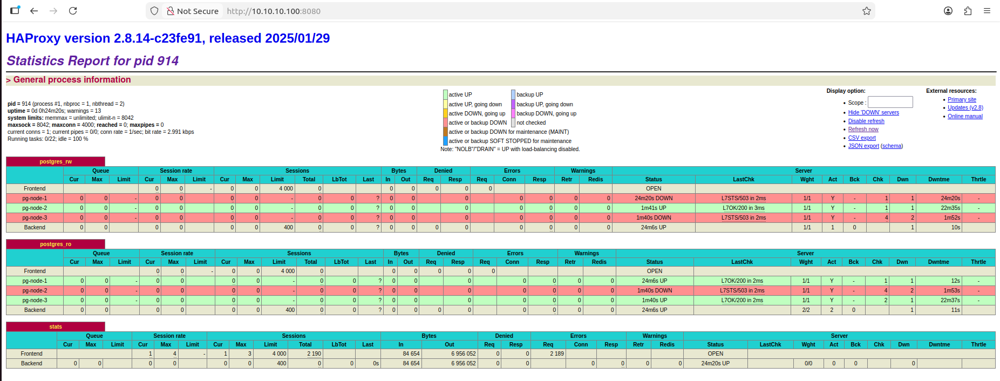

- А теперь давайте просто остановим службу Patroni на новом Лидере ноде **pg-node-2** и посмотрим, что из этого получиться.

Мы видим, что кластер Patroni фиксирует что вторая нода остановлена (точнее служба Patroni).

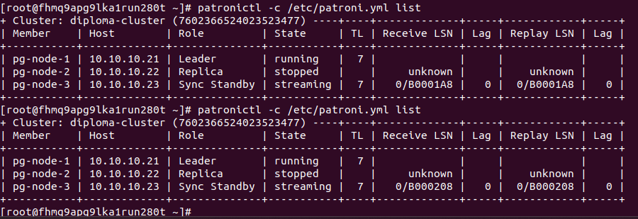

Далее мы видим что HAProxy на это реагирует и отражает текущую обстановку. Мы видим, что теперь Лидер это нода **pg-node-1**.

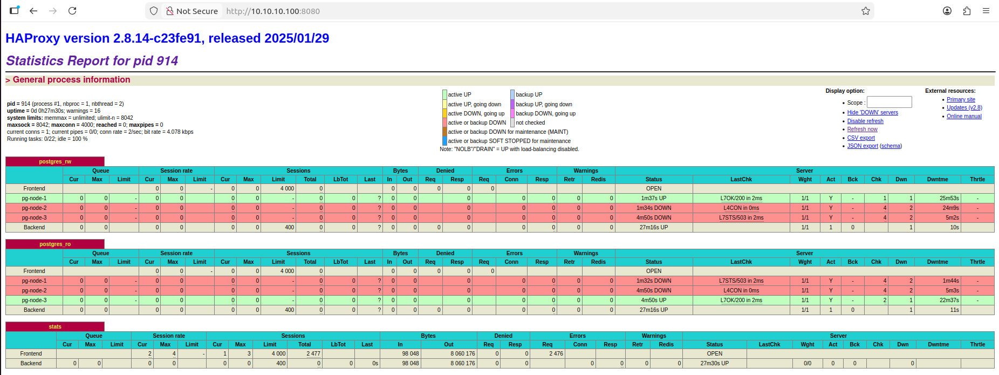

## Тестирование нагрузкой

1. Заходим в наш кластер ```psql -h 10.10.10.100 -p 5432 -U postgres -d postgres```
2. Создаем базу данных для тестирования нагрузки ```CREATE DATABASE pgbench_test;``` и выходим ```\q```.
3. С ноды управления ```pgbench -i -s 10 -h 10.10.10.100 -p 5432 -U postgres pgbench_test```.

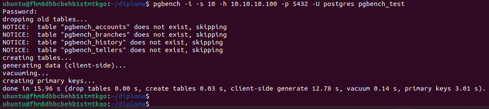

Далее можем просмотреть результат выполнения команды.

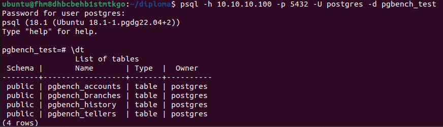

4. Также с ноды управления ```pgbench -c 20 -j 2 -P 5 -T 300 pgbench_test -h 10.10.10.100 -p 5432 -U postgres```

Смотрим результаты:

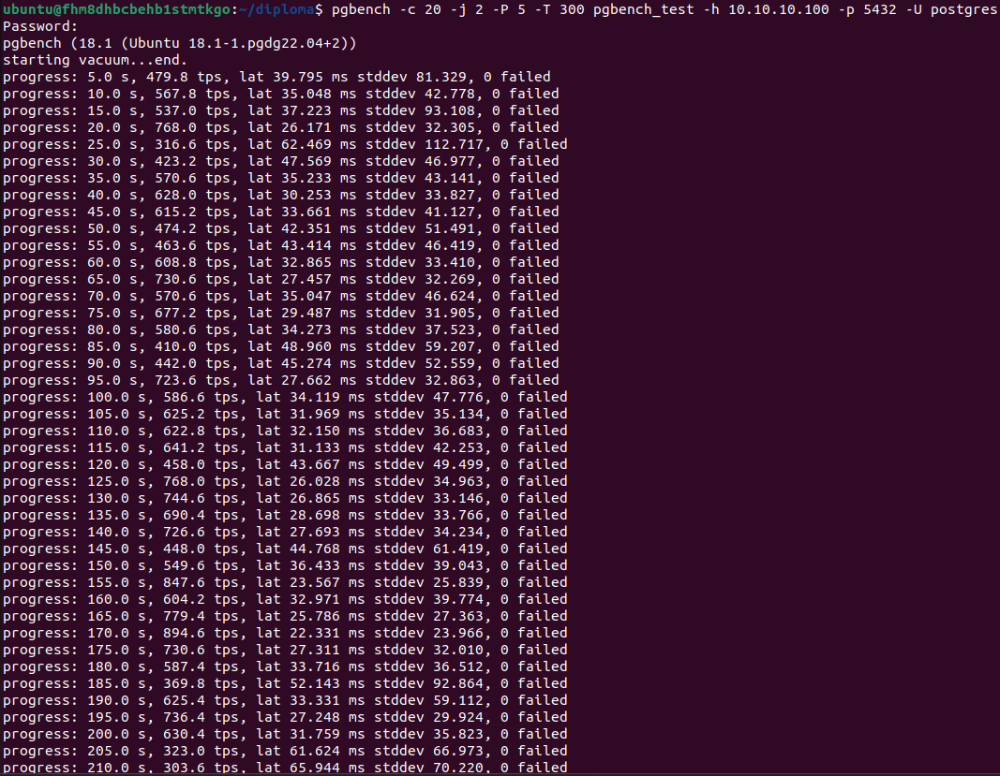

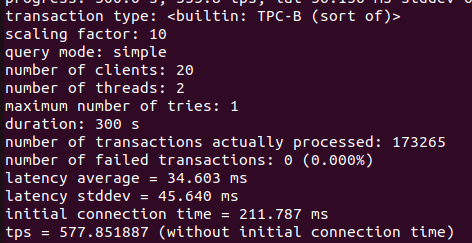

Результаты не выдающиеся, но:
1. Кластер не тюнинговался на самую быструю работу
2. У нас есть одна синхронная нода, которая влияет на скорость работы всего кластера (записи)
3. У нас слабенькие виртуальные машины

Графики Grafana под нагрузкой:

На графиках мы видим что растет нагрузка, а с ней и значения на графиках.

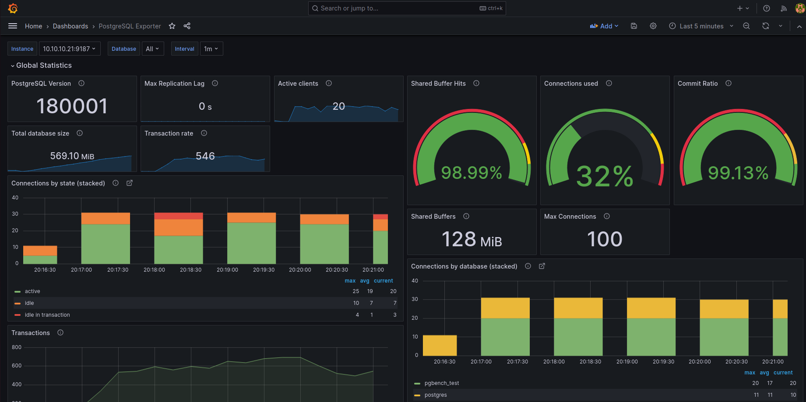

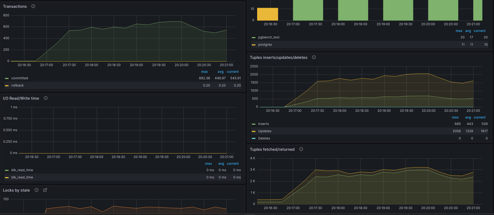

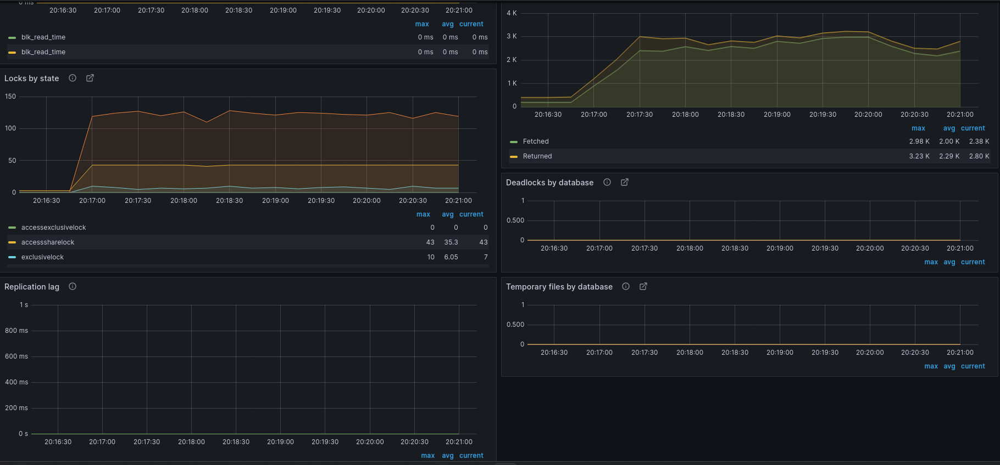

## Что мне стоит знать из важного?

1. Кластер имеет одну синхронную и одну ассинхронную ноду
2. Кластер не настроен для работы для хранения архивных логов WAL. Для работы с архивными логами используются специальные инструменты такие как WAL-G или Barman. **А что это означает?** Это означает что если Вам надо будет вдруг восстановиться на определенную минуту или секунду и за определенный день, то без настройки этих компонентов Вы этого сделать не сможете, это еще называется PITR. Поэтому если Вам надо будет настраивать такие инструменты хранения архивных логов как WAL-G или Barman, то измените пожалуйста конфигурационный файл Patroni и перезапустите кластер Patroni.
3. Если Вам нужно внести какие то настройки для PostgreSQL, то все настройки вносятся через Patroni, так как уже он управляет кластером.
4. Не используйте логины или пароли в Вашем продуктивном контуре из данного проекта так как здесь они используются для тестирования. 
5. Размещайте только одну продуктивную базу в кластере серверов Patroni + PostgreSQL, это является золотым стандартом. Отмечу, что есть много причин, чтобы следовать этому правилу в силу особенностей архитектуры PostgreSQL.
6. Всегда делайте резервные копии несмотря на то что у Вас есть HA кластер. И старайтесь их периодически восстанавливать для оценки времени восстановления и чтобы проверить всё ли восстановилось, то что было необходимо восстановить.